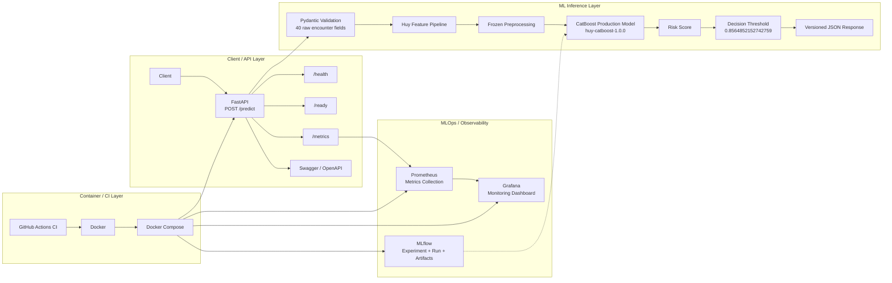

# Architecture — Huy Final CatBoost

## 1. High-level architecture

The Patient Readmission ML System is organized into four main layers:

1. Client and API layer
2. ML inference layer
3. MLOps and observability layer
4. CI and containerization layer



The current architecture intentionally does not include NGINX, Alertmanager, Kubernetes, a separate Feature Store, or automated cloud deployment because these components are not part of the current implementation.

## 2. Online inference

The production inference path is:

```text
POST /predict
  → strict Pydantic validation of 40 raw encounter fields
  → Huy manual mappings and diagnosis grouping
  → utilization, medication-count and interaction features
  → frozen log/standard/min-max transformations
  → 52 ordered CatBoost features (7 categorical)
  → final CatBoost predict_proba[:, 1]
  → decision threshold 0.8564852152742759
  → versioned JSON response
```

The model and JSON contract files under `models/production_huy/` are loaded once during the FastAPI lifespan.

The `/ready` endpoint returns 200 only after model identity, embedded feature order, categorical indices, preprocessing state, version and threshold validate together.

The public API never accepts identifiers, target labels, or already-engineered model features.

The compatibility alias `/api/v1/predict` executes the same Huy production model and is hidden from Swagger.

There is no second experimental model endpoint in the current production API.

## 3. Component responsibilities

| Component            | Responsibility                                                                                         |
| -------------------- | ------------------------------------------------------------------------------------------------------ |
| FastAPI              | Exposes prediction, health, readiness and metrics endpoints and manages the production model lifecycle |
| Pydantic schemas     | Validates the 40 raw API input fields                                                                  |
| Huy Feature Pipeline | Reconstructs the feature engineering logic used by the final production model                          |
| Frozen preprocessing | Applies the stored transformations without refitting them during inference                             |
| CatBoost             | Generates the readmission probability                                                                  |
| Decision threshold   | Converts the probability into the final binary prediction                                              |
| MLflow               | Tracks the production experiment, run, metrics, parameters, tags and model artifacts                   |
| Prometheus           | Scrapes API metrics from `/metrics`                                                                    |
| Grafana              | Visualizes request, latency, error, prediction and model-readiness metrics                             |
| Docker Compose       | Runs the local multi-service environment                                                               |
| GitHub Actions       | Runs linting, formatting, tests, coverage checks and Docker build                                      |

## 4. Offline reconstruction

The offline pipeline reconstructs the production model input without retraining the model.

`src/data/splitting.py`:

1. Applies Huy's row-level exclusions.
2. Keeps the first encounter for each `patient_nbr`.
3. Maps `readmitted` into `readmitted_30d`.
4. Applies the same feature construction logic used by the production model.
5. Applies the standardized outlier filters.
6. Performs a stratified 80/20 train/test split.
7. Writes the resulting split files and split manifest.

The preprocessing state stored in `models/production_huy/preprocessing_state.json` is reused rather than refitted by the inference API.

## 5. MLflow and artifact flow

The final production model is tracked in the MLflow experiment:

`patient-readmission-production`

The production run is:

`huy-catboost-production-1.0.0`

The run records:

* model parameters
* evaluation metrics
* production tags
* model version
* feature set
* production artifacts

The production bundle contains:

* `model.pkl`
* `preprocessing_state.json`
* `feature_manifest.json`
* `metadata.json`
* `reference_predictions.json`

The API loads the production bundle from `models/production_huy/` during startup.

The API does not retrain the model during inference.

## 6. Monitoring architecture

FastAPI exposes a Prometheus-compatible `/metrics` endpoint.

Prometheus scrapes the API every 5 seconds using the configured `readmission-api` scrape target.

The current monitoring metrics include:

* HTTP request count
* HTTP request latency
* HTTP errors
* model readiness
* prediction counts
* prediction risk-score distribution

Grafana reads the Prometheus data source and provides the `Patient Readmission API` dashboard.

The current dashboard includes:

* Request volume
* Request latency
* Error rate
* Prediction-risk distribution
* Predicted-positive rate
* Model readiness

The current project contains Prometheus alert rules for:

* API unavailability
* model readiness
* elevated API error rate
* high API latency

Alert notification delivery through Alertmanager is not part of the current implementation.

## 7. CI architecture

GitHub Actions validates pull requests and pushes to the branches defined by the workflow.

The current CI pipeline performs:

1. Repository checkout with Git LFS
2. Production model bundle verification
3. Python 3.11.15 setup
4. Dependency installation
5. `pip check`
6. Ruff lint
7. Ruff format check
8. Pytest with coverage
9. Production Docker image build

The current CI coverage gate is 60%.

The production deployment step is not automated in the current repository.

## 8. Docker and runtime architecture

Docker Compose is used to run the local MLOps environment.

The current multi-service stack contains:

* FastAPI
* MLflow
* MLflow initialization job
* Prometheus
* Grafana

The main runtime services are exposed on:

| Service    |   Port | Purpose                                 |
| ---------- | -----: | --------------------------------------- |
| FastAPI    | `8000` | Prediction API                          |
| MLflow     | `5050` | Experiment tracking UI/server           |
| Grafana    | `3000` | Monitoring dashboard                    |
| Prometheus | `9090` | Metrics collection and alert evaluation |

Health checks are configured for the main services so that runtime readiness can be verified through Docker Compose.

The system is designed so that a reviewer can start the local multi-service environment through Docker Compose.

## 9. Artifact boundary

| Artifact                     | Role                                     |
| ---------------------------- | ---------------------------------------- |
| `model.pkl`                  | Final fitted CatBoost                    |
| `preprocessing_state.json`   | Frozen Huy scaling state                 |
| `feature_manifest.json`      | Raw/model/categorical order              |
| `metadata.json`              | Version, threshold, metrics, limitations |
| `reference_predictions.json` | Reload regression cases                  |

The API loads the production artifact bundle from `models/production_huy/`.

MLflow provides the experiment and artifact tracking layer for the production run.

## 10. Evaluation and Responsible AI

### Model evaluation

`src/models/evaluate.py` provides holdout evaluation and calibration-related analysis.

### Explainability

`src/evaluation/explainability.py` provides native CatBoost SHAP explanations.

### Fairness

`src/evaluation/fairness.py` performs subgroup analysis for:

* race
* gender
* age

The fairness analysis is descriptive and is not treated as an automatic fairness verdict.

Small groups are marked with a caution indicator so that subgroup metrics are interpreted with sample-size limitations in mind.

### Responsible use

The system is intended as a predictive decision-support component, not an autonomous clinical decision-maker.

The project documents model limitations, fairness considerations, explainability information and responsible-use constraints.

## 11. API and data flow

The end-to-end online flow is:

```text
Client
  ↓
POST /predict
  ↓
Pydantic validation
  ↓
Huy raw feature mappings
  ↓
Diagnosis grouping
  ↓
Feature engineering
  ↓
Frozen preprocessing
  ↓
52 ordered CatBoost features
  ↓
CatBoost predict_proba
  ↓
Risk score
  ↓
Decision threshold
  ↓
Prediction + status
  ↓
JSON response
```

Operational telemetry flows through:

```text
FastAPI
  ↓
/metrics
  ↓
Prometheus
  ↓
Grafana
```

Production model metadata and artifacts are tracked through:

```text
Production model
  ↓
MLflow experiment
  ↓
Run / Metrics / Parameters / Tags / Artifacts
```

## 12. Technology decisions and trade-offs

### FastAPI

FastAPI is used as the model-serving framework because the project requires a lightweight REST API with typed request validation and automatic OpenAPI/Swagger documentation.

**Trade-off:** It keeps the serving layer simple and lightweight, but the current system is intentionally designed around one production model rather than a multi-model serving platform.

### CatBoost

CatBoost is used as the final production classifier through the versioned Huy model bundle.

**Trade-off:** A frozen CatBoost bundle provides a relatively simple inference path for the project's tabular feature set, while model selection and retraining remain offline activities.

### Docker Compose

Docker Compose orchestrates the API, MLflow, Prometheus and Grafana services locally.

**Trade-off:** Compose provides reproducibility with low operational complexity, but it is not intended to provide the scalability and orchestration capabilities of a Kubernetes-based production platform.

### MLflow

MLflow provides experiment and artifact tracking for the production candidate.

**Trade-off:** MLflow adds traceability and reproducibility, while the current project does not introduce a separate remote serving and deployment platform.

### Prometheus + Grafana

Prometheus collects operational metrics and Grafana visualizes them.

**Trade-off:** The combination provides a lightweight observability stack for the project, while more advanced distributed monitoring and long-term analytics are outside the current scope.

### GitHub Actions

GitHub Actions automates linting, formatting checks, testing, coverage verification and Docker image building.

**Trade-off:** It provides low-friction CI integration with GitHub, while deployment automation is intentionally outside the current implementation.

## 13. Architecture principles

The current implementation follows these principles:

* **Reproducibility** — frozen preprocessing and versioned model artifacts
* **Traceability** — MLflow run metadata and Git-based source control
* **Separation of concerns** — offline evaluation/training is separated from online inference
* **Fail-fast readiness** — `/ready` validates the production model contract before serving traffic
* **Observability** — API and model-serving behavior is exposed through Prometheus metrics
* **Testability** — API, data, evaluation and model-related behavior is covered by automated tests
* **Controlled scope** — the system currently serves one production CatBoost model

## 14. Current architecture limitations

The current implementation is intentionally scoped as a course project and has several limitations:

* Production deployment is not automated through CI/CD.
* Alert notification delivery is not implemented through Alertmanager.
* The architecture is designed for one production model rather than a multi-model serving platform.
* Docker Compose is intended for reproducible local and multi-service execution rather than large-scale orchestration.
* Monitoring focuses on service and prediction metrics rather than a complete data-drift and concept-drift pipeline.
* Model retraining is performed offline rather than automatically triggered from the serving environment.

These limitations are documented so that the project does not claim capabilities that are not implemented in the current repository.
