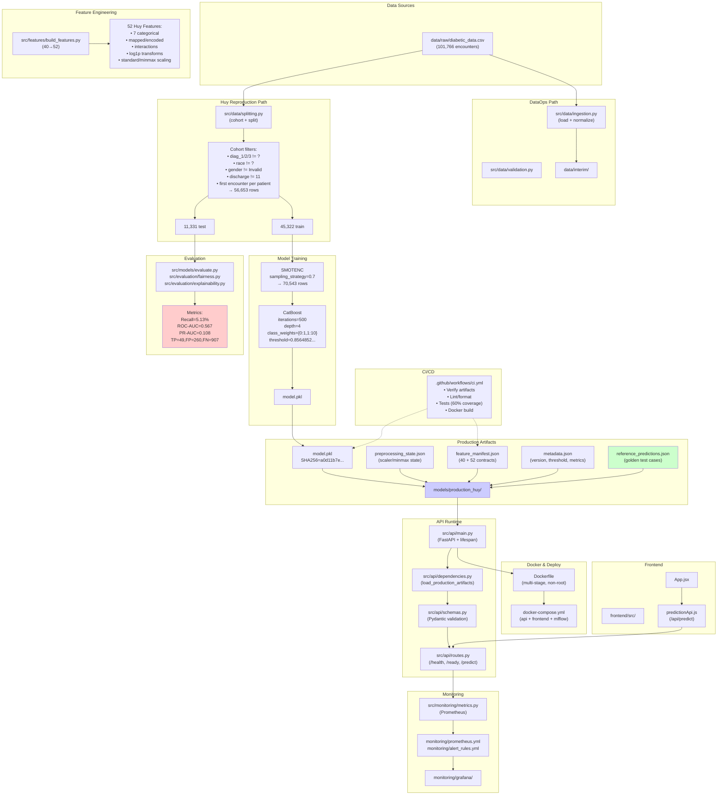
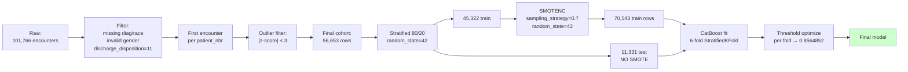
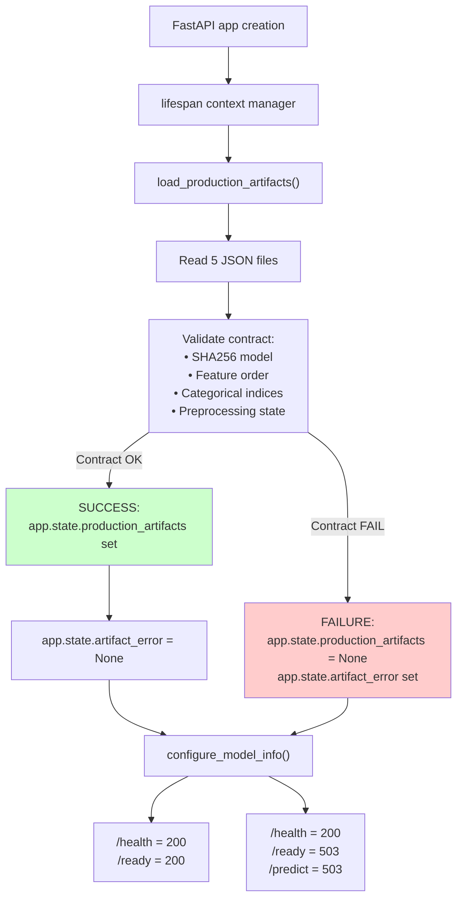
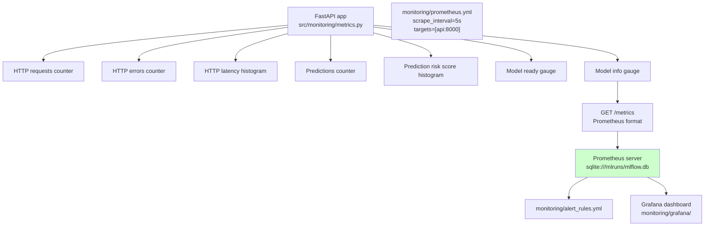

# AUDIT TOÀN DIỆN: Patient Readmission ML System

**Ngày audit:** 2026-08-15
**Phạm vi:** Repository source code thực tế (không phụ thuộc vào README/documentation)
**Phương pháp:** Code trace, dependency analysis, artifact inspection
**Kết luận:** Project là MLOps demo có reproducibility tốt với model performance yếu

---

## EXECUTIVE SUMMARY

### Mục đích
Hệ thống dự đoán nguy cơ tái nhập viện 30 ngày cho bệnh nhân tiểu đường, sử dụng **mô hình CatBoost cuối cùng từ notebook của Huy**.

### Thực tế quan trọng
- **Data:** 101,766 encounters → 56,653 final cohort (44% lọc)
- **Model:** CatBoost, 52 features, threshold 0.8564852152742759
- **Eval:** Recall 5.13%, ROC-AUC 0.567, PR-AUC 0.108 → Model yếu
- **Serving:** FastAPI + frozen artifacts, health/readiness checks
- **Monitoring:** Prometheus + Grafana + alerts
- **Infra:** Docker Compose, MLflow, CI tests model SHA256
- **Production readiness:** HIGH (reproducibility, contracts, tests) / LOW (model performance)

### Điểm nhấn chính
1. **Frozen model, không retrain:** Container serve model pickle, không fit data
2. **Feature contract 40→52:** API nhận 40 raw fields, preprocess thành 52 model features
3. **Reference predictions:** Golden test cases (low 0.664 → 0, high 0.938 → 1)
4. **Data leakage acknowledged:** Preprocessing state fitted trước split
5. **Training-serving mismatch:** Cohort yêu cầu diag_2/diag_3 nhưng API chỉ nhận diag_1
6. **Probability uncalibrated:** Brier 0.386, không có post-hoc calibration

---

## KIẾN TRÚC THỰC TẾ

### A. Full Project Architecture (Mermaid)



### B. Model Training Flow (Chi tiết)



### C. FastAPI Startup Flow



### D. Prediction Request Flow

```mermaid
graph LR
    A["React client"]
    B["40 fields payload"]
    C["POST /predict"]
    D["Pydantic validation"]
    E["PredictionRequest model"]
    F["prepare_model_input()"]
    G["build_huy_features()"]
    H["52 model features"]
    I["predict_proba()"]
    J["risk_score = P(class 1)"]
    K["if risk_score >= 0.8564852<br/>→ prediction = 1<br/>else → 0"]
    L["PredictionResponse JSON"]
    M["Frontend display"]

    A --> B --> C --> D --> E --> F --> G --> H --> I --> J --> K --> L --> M

    style H fill:#ccffcc
```



### E. Monitoring Architecture



---

## DATA FLOW ANALYSIS

### 1. Raw Data Ingestion

**File:** [src/data/ingestion.py](src/data/ingestion.py)

**Nhận vào:**
- `data/raw/diabetic_data.csv` (101,766 rows, 50 columns)
- Encoding: UTF-8 or latin-1 fallback
- Missing: `?` values → `NaN`

**Xử lý:**
```python
dataframe = pd.read_csv(
    input_path,
    na_values=["?"],
    keep_default_na=True,
    low_memory=False
)
```
- Normalize column names: snake_case, remove spaces/dashes
- Atomic CSV write via temporary file

**Trả ra:**
- `data/interim/ingested_data.csv`
- `data/metadata/ingestion_manifest.json`
  - SHA256 checksum of source
  - Row/column count
  - Dataset version

**Kinh nghiệm:**
- Ingestion.py TỒN TẠI nhưng **KHÔNG nằm trong Huy training pipeline**
- Huy training đọc trực tiếp `data/raw/diabetic_data.csv`

### 2. Cohort Construction & Splitting

**File:** [src/data/splitting.py](src/data/splitting.py)

**Nhận vào:**
- `data/raw/diabetic_data.csv` (101,766)
- `models/production_huy/preprocessing_state.json` (frozen)

**Huy Cohort Filters** (function: `create_huy_cohort`):

```
101,766 rows
├─ diag_1 != "?" (keep)
├─ diag_2 != "?" (keep)
├─ diag_3 != "?" (keep)
├─ race != "?" (keep)
├─ gender != "Unknown/Invalid" (keep)
└─ discharge_disposition_id != 11 (keep)
→ Survivors after filter: ~63,000 (estimate)

→ drop_duplicates(patient_nbr, keep="first")
→ First encounter per patient: 56,653 rows
│
├─ Map readmitted: "<30"→1, ">30"→0, "NO"→0
├─ Transform 40 raw fields → 52 Huy features (build_huy_features)
├─ Filter outliers: |z-score| > 3 on standard_1 + standard_2 features
→ Final cohort: 56,653 rows
```

**Stratified 80/20 Split**:
```
56,653 cohort
├─ Train (80%): 45,322 rows
│  ├─ Negative (readmitted_30d=0): 41,496
│  └─ Positive (readmitted_30d=1): 3,826
└─ Test (20%): 11,331 rows
   ├─ Negative: 10,375
   └─ Positive: 956
```

**Random state:** 42 (stratified=True)

**Trả ra:**
- `data/interim/splits/train.csv`
- `data/interim/splits/test.csv`
- `data/splits/split_manifest.json`

**Tại sao từ 101k xuống 56k?**
- 101,766 encounters
- ~71,518 unique patients (stated)
- Filters (diag/race/gender/disposition): ~-13k
- First encounter policy: 71,518 → 56,653
- Outliers removed: ~-200
- **Kết quả:** 56,653 final cohort

### 3. Feature Engineering (40 → 52)

**File:** [src/features/build_features.py](src/features/build_features.py)

**Constants:**
- `REQUEST_FEATURES`: 40 raw fields
- `MODEL_INPUT_FEATURES`: 52 after engineering
- `CATEGORICAL_MODEL_FEATURES`: 7 categorical indices

**REQUEST_FEATURES (40):**
```
1. race
2. gender
3. age
4. admission_type_id
5. discharge_disposition_id
6. admission_source_id
7. time_in_hospital
8. num_lab_procedures
9. num_procedures
10. num_medications
11. number_outpatient
12. number_emergency
13. number_inpatient
14. number_diagnoses
15. max_glu_serum
16. A1Cresult
17-36. 20 medication features (metformin, repaglinide, ..., acetohexamide)
37. change
38. diabetesMed
39. diag_1
(Điều ghi chú: diag_2, diag_3 dùng để filter cohort, không phải model input)
```

**Transformation Steps** (function: `build_huy_features`):

1. **Category Mapping:**
   - gender: {Female→0, Male→1}
   - age: "[80-90)" → 85 (midpoint)
   - change: {No→0, Ch→1}
   - diabetesMed: {No→0, Yes→1}

2. **Diagnosis Grouping:**
   - diag_1 ICD-9 → 9 level-1 groups
   - level1_diag1 feature
   - (V, E codes → 0; cardiac, respiratory, digestive, diabetes, trauma, rheumatologic, genitourinary, cancer → 1-8)

3. **Medication Encoding:**
   - numchange: count of Up/Down (medication changes)
   - nummed: count of medications != No
   - Each medication: No→0, else→1

4. **Utilization Features:**
   - number_emergency_log1p = log1p(number_emergency)
   - number_outpatient_log1p = log1p(number_outpatient)
   - service_utilization_log1p = log1p(out + emerg + inp)
   - number_inpatient_log1p = log1p(number_inpatient)

5. **Interaction Features** (9 total):
   - time_in_hospital × num_lab_procedures
   - num_medications × num_lab_procedures
   - num_medications × number_diagnoses
   - age × number_diagnoses
   - change × num_medications
   - number_diagnoses × time_in_hospital
   - num_medications × log(time_in_hospital)
   - num_medications × log1p(num_procedures)
   - num_medications × log1p(numchange)

6. **Scaling (Frozen from notebook):**
   - **standard_1:** Features: [time_in_hospital, num_lab_procedures, ...]
     ```
     (x - mean) / scale
     ```
   - **minmax_1:** Features: [interactions]
     ```
     (x - min) / (max - min)
     ```
   - **standard_2:** Features: [log transforms]
     ```
     (x - mean) / scale
     ```
   - **age_minmax:** (age - min) / (max - min)

7. **Final Categorical Conversion:**
   ```python
   for feature in CATEGORICAL_MODEL_FEATURES:
       result[feature] = result[feature].astype(str)
   ```

**MODEL_INPUT_FEATURES (52):**
- 7 categorical: race, admission_type_id, discharge_disposition_id, admission_source_id, max_glu_serum, A1Cresult, level1_diag1
- 45 numeric (20 medications + 13 base + 4 log1p + 8 interactions)

**Thứ tự feature CRITICAL:**
- Model sử dụng feature index (0-51)
- CatBoost embedded feature names: tuple of 52 strings
- Mismatch → ArtifactContractError

**CatBoost Categorical Indices:**
```
[0, 3, 4, 5, 11, 12, 37]
→ maps to:
  race, admission_type_id, discharge_disposition_id,
  admission_source_id, max_glu_serum, A1Cresult, level1_diag1
```

---

## HUY TRAINING & MODEL REPRODUCTION

### 1. Source Notebook
**File:** `notebooks/reference/Huy-prediction-on-hospital-readmission.ipynb`

**Không audit chi tiết (external source)** nhưng source code reproduce toàn bộ preprocessing & split.

### 2. SMOTENC Resampling

**Applied on training set only** (45,322 rows):

```
Before SMOTE:
- Negative (0): 41,496
- Positive (1): 3,826
- Ratio: 1 : 0.092

SMOTENC(sampling_strategy=0.7, random_state=42):
- sampling_strategy=0.7 means:
  n_samples_positive_after = n_negative × 0.7
  = 41,496 × 0.7 ≈ 29,047

- Total after SMOTE: 41,496 + 29,047 = 70,543 rows

During SMOTENC:
- Synthetic samples created
- 7 categorical features handled: race, admission_type_id, ...
- random_state=42 reproducible
```

**Test set:** NO SMOTE (11,331 original)

### 3. CatBoost Final Training

**File:** Notebook (Huy) — reproduced via frozen model.pkl

**Hyperparameters** (from metadata.json):
```json
{
  "iterations": 500,
  "depth": 4,
  "learning_rate": 0.018489688756468402,
  "l2_leaf_reg": 0.0032362988111549118,
  "random_strength": 0.48580347723806133,
  "bagging_temperature": 0.8738560829870741,
  "random_seed": 42
}
```

**Class Weights:**
```python
class_weights = {0: 1, 1: 10}
```
→ Penalize negative 1x, positive 10x (imbalanced data)

**CV Strategy:**
- 6-fold StratifiedKFold
- shuffle=True
- random_state=42

### 4. Decision Threshold Optimization

**Value:** 0.8564852152742759

**Procedure** (inferred from metadata):
1. Train on 5 folds, predict on fold 6 (holdout)
2. Compute threshold per fold (maximize F1 or PR-AUC)
3. Average thresholds across 6 folds
4. Final threshold applied to holdout test

**Why not 0.5?**
- Class weights and SMOTENC shift decision boundary
- High threshold prioritizes precision (avoid FP) over recall

**Limitation:** Threshold optimization may use training-fold predictions rather than separate validation set.

---

## FINAL EVALUATION

### 1. Test Set Metrics

**Test data:** 11,331 encounters (holdout)

**Confusion Matrix at threshold 0.8564852:**
```
           Predicted 0    Predicted 1
Actual 0:  10,115 (TN)       260 (FP)
Actual 1:    907 (FN)         49 (TP)

Total Actual 0: 10,375
Total Actual 1:    956
Total Predicted 0: 11,022
Total Predicted 1:   309
```

**Metrics:**
```
Precision = TP / (TP + FP) = 49 / 309 = 0.1586
Recall = TP / (TP + FN) = 49 / 956 = 0.0513
F1 = 2 × (precision × recall) / (precision + recall) = 0.0775
ROC-AUC = 0.5668 (barely > random 0.5)
PR-AUC = 0.1081
Brier score = mean((pred - actual)²) = 0.3856
```

**Interpretation:**
- **Recall 5.13%:** Model finds only 49 of 956 positive cases (miss 907)
- **Precision 15.86%:** When model predicts readmission, only 16% correct
- **ROC-AUC 0.567:** Barely better than random classifier (0.5)
- **Brier 0.386:** High; not well-calibrated
- **Model performance:** WEAK → Not suitable for production without human review

### 2. Calibration

**Status:** Not calibrated

From metadata:
```json
"posthoc_calibration": "none",
"probability_output": "raw_predict_proba"
```

→ Raw CatBoost probabilities (no rescaling, no temperature scaling)

### 3. Subgroup Analysis (Fairness Audit)

**File:** [src/evaluation/fairness.py](src/evaluation/fairness.py)

**Audit attributes:** race, gender, age

**Metrics per subgroup:**
- n (sample count)
- positives (class 1 count)
- prevalence (class 1 rate)
- pr_auc, roc_auc
- precision, recall, specificity, fpr
- predicted_positive_rate
- small_sample_caution (n < 200 or positives < 30)

**Limitation:** Report is descriptive, not prescriptive.

### 4. SHAP Explainability

**File:** [src/evaluation/explainability.py](src/evaluation/explainability.py)

**Method:** CatBoost native SHAP

**Output:**
- `models/production_huy/reports/global_shap_huy_features.csv`
  - model_feature
  - mean_abs_shap (global importance)
- `models/production_huy/reports/global_shap_huy_features.png`

**Interpretation:** SHAP describes model behavior, not causality

---

## FROZEN PRODUCTION ARTIFACTS

### Structure

```
models/production_huy/
├── model.pkl                      # CatBoost classifier
├── preprocessing_state.json       # Frozen scaler state
├── feature_manifest.json          # 40 & 52 feature contracts
├── metadata.json                  # Version, threshold, metrics, limitations
├── reference_predictions.json     # Golden test cases
└── reports/
    ├── evaluation_metrics.json    # holdout confusion matrix + metrics
    ├── calibration_curve.csv      # Calibration curve
    ├── global_shap_huy_features.csv
    ├── global_shap_huy_features.png
    ├── subgroup_fairness_report.csv
    └── fairness_gap_summary.csv
```

### Model SHA256
```
a0d11b7ed0c1956d10afbfda360ec24ae2c55f6d6d50d32ed50780a81160331b
```

Verified at CI runtime and API startup.

### Preprocessing State JSON

**Sections:**
- `standard_1`: features + mean + scale
- `minmax_1`: features + min + max
- `standard_2`: features + mean + scale
- `age_minmax`: min + max

**Never refitted:** Frozen from notebook cohort

### Feature Manifest JSON

**Fields:**
- feature_set: "HUY_FINAL_52"
- request_features: [40 field names]
- model_input_features: [52 feature names]
- categorical_model_features: [7 categorical names]

### Metadata JSON

```json
{
  "model_version": "huy-catboost-1.0.0",
  "model_sha256": "a0d11b7ed0c1956d10afbfda360ec24ae2c55f6d6d50d32ed50780a81160331b",
  "decision_threshold": 0.8564852152742759,
  "training": {
    "split": "stratified 80/20, random_state=42",
    "cv": "6-fold StratifiedKFold, shuffle=True, random_state=42",
    "resampling": "SMOTENC on training split, sampling_strategy=0.7, random_state=42",
    "class_weights": {"0": 1, "1": 10},
    "cohort_rows": 56653,
    "train_rows_before_resampling": 45322,
    "train_rows_after_resampling": 70543,
    "test_rows": 11331
  },
  "hyperparameters": {...},
  "final_test_metrics": {...},
  "limitations": [...]
}
```

### Reference Predictions JSON

```json
{
  "model_sha256": "a0d11b7ed0c1956d10afbfda360ec24ae2c55f6d6d50d32ed50780a81160331b",
  "decision_threshold": 0.8564852152742759,
  "cases": [
    {
      "request": "docs/api/sample_request.json",
      "risk_score": 0.6643320154788986,
      "prediction": 0
    },
    {
      "request": "docs/api/sample_high_risk_request.json",
      "risk_score": 0.9379868301418867,
      "prediction": 1
    }
  ]
}
```

**Purpose:** Regression test, not evaluation dataset

---

## FASTAPI RUNTIME

### 1. Startup (Lifespan)

**File:** [src/api/main.py](src/api/main.py)

```python
@asynccontextmanager
async def lifespan(app: FastAPI):
    try:
        app.state.production_artifacts = load_production_artifacts(...)
        app.state.artifact_error = None
        configure_model_info(ready=True, ...)
    except ArtifactContractError as exception:
        app.state.production_artifacts = None
        app.state.artifact_error = type(exception).__name__
        configure_model_info(ready=False)
    yield
```

**What happens:**
1. Load 5 JSON files + model.pkl
2. Validate contract (SHA256, feature order, categorical indices, preprocessing state)
3. If successful: app.state.production_artifacts = ProductionArtifacts(...)
4. If failed: app.state.production_artifacts = None, artifact_error set

**Crash behavior:** App continues running even if artifacts load fails

### 2. Health & Readiness Endpoints

**File:** [src/api/routes.py](src/api/routes.py)

**`GET /health`** → Always 200
```json
{
  "status": "healthy",
  "service": "Patient Readmission ML System",
  "version": "2.0.0"
}
```

**`GET /ready`** → 200 or 503
```json
// 200 (ready)
{
  "status": "ready",
  "model_loaded": true,
  "contract_validated": true,
  "model_version": "huy-catboost-1.0.0",
  "feature_set": "HUY_FINAL_52",
  "message": "Huy final CatBoost model is ready for inference."
}

// 503 (not ready)
{
  "status": "not_ready",
  "model_loaded": false,
  "contract_validated": false,
  "model_version": null,
  "feature_set": null,
  "message": "Huy production artifacts are unavailable or invalid."
}
```

**Distinction:**
- `/health` = liveness (service alive?)
- `/ready` = readiness (model usable?)

### 3. Prediction Endpoint

**File:** [src/api/routes.py](src/api/routes.py)

**Route:** `POST /predict` (also aliased `/api/v1/predict` hidden from Swagger)

**Request:**
- Pydantic model `PredictionRequest`
- Exactly 40 fields (extra=forbid)
- No patient ID, target, or secondary diagnoses

**Validation:**
- race: Literal[African/Asian/Caucasian/Hispanic/Other]
- gender: Literal[Female/Male]
- age: Literal["[0-10)", "[10-20)", ..., "[90-100)"]
- admission_type_id: Literal[1-8]
- discharge_disposition_id: Literal[1,2,3,...,28]
- admission_source_id: Literal[1,2,3,...,25]
- time_in_hospital: int[1-14]
- num_lab_procedures: int[1-132]
- num_procedures: int[0-6]
- num_medications: int[1-81]
- number_outpatient: int[0-42]
- number_emergency: int[0-76]
- number_inpatient: int[0-21]
- number_diagnoses: int[1-16]
- max_glu_serum: Literal[None/Unknown/Norm/>200/>300]
- A1Cresult: Literal[None/Unknown/Norm/>7/>8]
- 20 medications: Literal[No/Steady/Up/Down]
- change: Literal[No/Ch]
- diabetesMed: Literal[No/Yes]
- diag_1: str matching regex `^(?:[VE]\d+(?:\.\d+)?|\d+(?:\.\d+)?)$` (ICD-9 code)

**Processing:**
```
PredictionRequest (40 fields)
  ↓
prepare_model_input()
  ↓
build_huy_features() (40 → 52)
  ↓
artifacts.model.predict_proba()
  ↓
risk_score = proba[0, 1]
  ↓
prediction = 1 if risk_score >= 0.8564852 else 0
  ↓
PredictionResponse JSON
```

**Response:**
```json
{
  "model_version": "huy-catboost-1.0.0",
  "risk_score": 0.8,
  "decision_threshold": 0.8564852152742759,
  "prediction": 1,
  "status": "high_risk"  // or "not_high_risk"
}
```

### 4. Dependency Injection

**File:** [src/api/dependencies.py](src/api/dependencies.py)

**Function:** `load_production_artifacts(artifact_dir: Path)`

**Caching:** `@lru_cache(maxsize=4)` → Reload not automatic on code restart

**Contract Validation:**
```python
validate_artifact_contract(
    model,
    manifest,
    state,
    metadata
)
```

Checks:
- model_version matches EXPECTED
- feature_set consistent
- request/model/categorical features order exact
- decision_threshold is numeric [0,1]
- CatBoost.feature_names_ = MODEL_INPUT_FEATURES
- CatBoost.get_cat_feature_indices() maps correctly
- preprocessing_state has all sections

**Error:** `ArtifactContractError` → Exception caught in lifespan

### 5. Exception Handling

**File:** [src/api/exception_handlers.py](src/api/exception_handlers.py)

**HTTP Status:**
- **422:** Pydantic validation error (bad request schema)
- **500:** Unexpected server error
- **503:** Model unavailable (Service Unavailable)

**Privacy:** Error messages do NOT echo submitted values

---

## AUTOMATED TESTS

### 1. Production Contract Tests

**File:** [tests/production/test_production_contract.py](tests/production/test_production_contract.py)

**Test suite:**

1. **test_huy_manifest_and_embedded_model_contract_match()**
   - Verify REQUEST_FEATURES = 40
   - Verify MODEL_INPUT_FEATURES = 52
   - Verify CATEGORICAL_MODEL_FEATURES = 7
   - Verify CatBoost.feature_names_ matches order
   - Verify categorical_indices map correctly

2. **test_final_model_identity_and_threshold_are_frozen()**
   - model_version = "huy-catboost-1.0.0"
   - decision_threshold = 0.8564852152742759 (exact)
   - model_sha256 matches metadata
   - class_weights = {0:1, 1:10}

3. **test_raw_request_is_transformed_to_finite_52_feature_frame()**
   - Load sample request (40 fields)
   - Transform to model input (52 features)
   - Check all numeric features are finite

4. **test_reference_predictions_zero_and_one_reproduce_after_reload()**
   - Low risk case: risk_score ≈ 0.6643, prediction = 0
   - High risk case: risk_score ≈ 0.9379, prediction = 1
   - Clear cache, reload, verify exact reproducibility (rtol=0, atol=1e-12)

5. **test_only_huy_notebook_and_bundle_are_authoritative()**
   - Reference notebook exists
   - Reference model exists
   - No competing models (e.g., production_v1)

**Coverage:** Tests protect contract and prevent regression

### 2. Other Test Suites

```
tests/
├── api/
│   ├── test_routes.py (endpoint behavior)
│   └── test_schemas.py (Pydantic validation)
├── data/
│   └── test_splitting.py (cohort construction)
├── unit/
│   ├── test_features.py (feature engineering)
│   └── test_monitoring.py (metrics)
├── integration/
│   └── test_api_integration.py (end-to-end)
└── production/
    └── test_production_contract.py (frozen artifacts)
```

**CI runs:** pytest --cov=src --cov-fail-under=60 (60% minimum coverage)

---

## MONITORING SYSTEM

### 1. Prometheus Metrics

**File:** [src/monitoring/metrics.py](src/monitoring/metrics.py)

**HTTP Metrics:**
- `readmission_http_requests_total`: Counter
  - labels: method, route, status_code
  - tracks all requests
- `readmission_http_errors_total`: Counter
  - labels: method, route, status_code
  - tracks status >= 400
- `readmission_http_request_duration_seconds`: Histogram
  - labels: method, route
  - buckets: 0.01, 0.025, ..., 10

**Model Metrics:**
- `readmission_predictions_total`: Counter
  - labels: model, prediction (0 or 1)
  - counts by outcome
- `readmission_prediction_risk_score`: Histogram
  - labels: model
  - buckets: 0.05, 0.1, 0.25, ..., 0.8564852, ..., 1.0
  - distribution of scores

**Readiness Metrics:**
- `readmission_model_ready`: Gauge
  - value 1 (ready) or 0 (unavailable)
- `readmission_model_info`: Gauge
  - labels: model_version, feature_set
  - value always 1 (indicator label metric)

**Privacy:** No patient IDs, encounter IDs, or raw predictions (only counts & aggregates)

**Endpoint:** `GET /metrics` → Prometheus text format

### 2. Prometheus Configuration

**File:** [monitoring/prometheus.yml](monitoring/prometheus.yml)

```yaml
global:
  scrape_interval: 5s
  evaluation_interval: 5s

rule_files:
  - /etc/prometheus/alert_rules.yml

scrape_configs:
  - job_name: readmission-api
    metrics_path: /metrics
    static_configs:
      - targets:
          - api:8000  # Docker DNS, not localhost
```

**Container networking:** `api:8000` resolves inside Docker network

### 3. Alert Rules

**File:** [monitoring/alert_rules.yml](monitoring/alert_rules.yml)

**Alert 1: ReadmissionApiUnavailable**
```yaml
expr: up{job="readmission-api"} == 0
for: 1m
severity: critical
```
→ Fires if API unreachable for 1 minute

**Alert 2: ReadmissionModelNotReady**
```yaml
expr: readmission_model_ready == 0
for: 1m
severity: critical
```
→ Fires if model artifacts unavailable for 1 minute

**Alert 3: ReadmissionApiElevatedErrorRate**
```yaml
expr: (sum(rate(readmission_http_errors_total[5m])) / clamp_min(sum(rate(readmission_http_requests_total[5m])), 0.001)) > 0.05 AND sum(rate(readmission_http_requests_total[5m])) > 0.05
for: 5m
severity: warning
```
→ Fires if error rate > 5% AND volume > 0.05 req/s for 5 minutes

**Alert 4: ReadmissionApiHighLatency**
```yaml
expr: histogram_quantile(0.95, sum by (le) (rate(readmission_http_request_duration_seconds_bucket[5m]))) > 1
for: 5m
severity: warning
```
→ Fires if P95 latency > 1 second for 5 minutes

### 4. Grafana Dashboards

**Directory:** [monitoring/grafana/](monitoring/grafana/)

**Purpose:** Visualize Prometheus metrics

**Typical panels:**
- Request rate (req/sec)
- Error rate (%)
- P95 latency (seconds)
- Prediction distribution (low/medium/high risk)
- Model readiness (up/down)
- Response time heatmap

---

## DOCKER CONTAINERIZATION

### 1. Dockerfile

**File:** [Dockerfile](Dockerfile)

```dockerfile
FROM python:3.11.15-slim-bookworm

ENV PYTHONDONTWRITEBYTECODE=1 \
    PYTHONUNBUFFERED=1

WORKDIR /app

COPY requirements.txt .
RUN python -m pip install --no-cache-dir --upgrade pip \
    && python -m pip install --no-cache-dir -r requirements.txt

RUN useradd --create-home --uid 10001 appuser

COPY --chown=appuser:appuser src ./src
COPY --chown=appuser:appuser models/production_huy ./models/production_huy

USER appuser

EXPOSE 8000

HEALTHCHECK --interval=30s --timeout=5s --start-period=10s --retries=3 \
    CMD ["python", "-c", "import urllib.request; urllib.request.urlopen('http://127.0.0.1:8000/ready', timeout=3)"]

CMD ["uvicorn", "src.api.main:app", "--host", "0.0.0.0", "--port", "8000"]
```

**Key points:**
- **Base:** Python 3.11.15 slim (small image)
- **Model included:** COPY models/production_huy into image
- **Non-root user:** appuser (UID 10001)
- **No training:** Container serves frozen model, no retrain
- **Healthcheck:** Probes /ready endpoint

### 2. Docker Compose

**File:** [docker-compose.yml](docker-compose.yml)

**Services:**

| Service | Image | Port | Depends On | Purpose |
| --- | --- | --- | --- | --- |
| api | patient-readmission-api:2.0.0 | 8000 | - | FastAPI backend |
| frontend | patient-readmission-frontend:2.0.0 | 5173 | api:healthy | React + Nginx |
| mlflow | ghcr.io/mlflow/mlflow:v3.15.1 | 5000 | - | Experiment tracking |
| prometheus | prom/prometheus:latest | 9090 | - | Metrics collection |
| grafana | grafana/grafana:latest | 3000 | prometheus | Dashboard |

**Network:** Docker bridge (service-name:port resolution)

**Health checks:**
- api: calls /ready endpoint
- frontend: wget / (nginx)

**Restart:** unless-stopped (auto-restart on crash)

---

## FRONTEND

### 1. API Service

**File:** [frontend/src/services/predictionApi.js](frontend/src/services/predictionApi.js)

```javascript
export async function predictReadmission(payload) {
  const response = await fetch("/api/predict", {
    method: "POST",
    headers: { "Content-Type": "application/json" },
    body: JSON.stringify(payload),
  });
  return parseResponse(response);
}

export async function checkReady() {
  const response = await fetch("/api/ready");
  return parseResponse(response);
}
```

**Endpoint:** `/api/predict` (reverse proxied by Nginx in Docker)

**Error handling:** Parse Pydantic detail errors, display field-level messages

### 2. App Component

**File:** [frontend/src/App.jsx](frontend/src/App.jsx)

**Flow:**
1. Render form with 40 input fields
2. Collect user input
3. Build payload
4. Call predictReadmission()
5. Display risk_score, status
6. Handle errors

### 3. Nginx Reverse Proxy

**File:** [frontend/nginx.conf](frontend/nginx.conf)

**Purpose:** Route `/api/*` to backend API container

```nginx
location /api {
    proxy_pass http://api:8000;  # Docker DNS
}
```

**Dev vs. Docker:**
- **Dev:** Vite dev server proxies to localhost:8000
- **Docker:** Nginx reverse proxy to api:8000

---

## MLFLOW EXPERIMENT TRACKING

### 1. Champion Logging

**File:** [src/evaluation/mlflow_champion.py](src/evaluation/mlflow_champion.py)

**Purpose:** Log frozen Huy bundle to MLflow **without retraining**

**Workflow:**
```python
log_frozen_champion(
    artifact_dir=Path("models/production_huy"),
    tracking_uri="sqlite:///mlruns/mlflow.db",
    experiment_name="patient-readmission-huy-production"
)
```

**Logged items:**
- **Tags:** stage, feature_set, selection_status (champion), model_version, model_type
- **Params:** All hyperparameters + decision_threshold + calibration + model_sha256
- **Metrics:** final_precision, final_recall, final_roc_auc, etc.
- **Artifacts:**
  - model.pkl
  - preprocessing_state.json
  - metadata.json
  - feature_manifest.json
  - reference_predictions.json
  - All reports/

**Idempotency:** Checks if run already exists (by model_version + champion tag)

### 2. Docker Compose MLflow

**Service:** mlflow (ghcr.io/mlflow/mlflow:v3.15.1)

**Backend:** SQLite (local file)

**Tracking URI:** `sqlite:///mlruns/mlflow.db`

**Difference from Prometheus:**
- MLflow: Experiment tracking, artifact storage, model versioning
- Prometheus: Runtime metrics, time-series monitoring

---

## CI/CD WORKFLOW

### File: [.github/workflows/ci.yml](.github/workflows/ci.yml)

**Trigger:** PR, push to main/develop

**Jobs:**

1. **Verify Huy production bundle:**
   ```bash
   test -s models/production_huy/model.pkl
   test -s models/production_huy/preprocessing_state.json
   test -s models/production_huy/feature_manifest.json
   test -s models/production_huy/metadata.json
   test -s models/production_huy/reference_predictions.json
   ```
   → Fail if any artifact missing

2. **Install dependencies:**
   ```bash
   python -m pip install -r requirements.txt
   python -m pip check
   ```

3. **Lint & format:**
   ```bash
   ruff check .
   ruff format --check .
   ```

4. **Tests & coverage:**
   ```bash
   pytest --cov=src --cov-fail-under=60 -q
   ```
   → Fail if coverage < 60%
   → Runs production contract tests

5. **Docker build:**
   ```bash
   docker build --tag patient-readmission-api:ci .
   ```
   → Verify Dockerfile builds

**What's NOT in CI:**
- Model retraining
- Hyperparameter tuning
- Data pipeline runs

**Purpose:** Protect frozen model integrity, not improve performance

---

## RESPONSIBLE AI & FAIRNESS

### 1. Limitations

**File:** [MODEL_CARD.md](MODEL_CARD.md) & [RESPONSIBLE_AI.md](RESPONSIBLE_AI.md)

**Documented limitations:**
1. Final recall 5.13% → misses 90% of positives
2. Raw probability not calibrated (Brier 0.386)
3. Preprocessing statistics fit before split → leakage
4. SMOTENC applied before CV, not inside folds
5. Thresholds and subgroup results dataset-specific
6. Medication direction collapsed (Up/Down/Steady → 1)

### 2. Fairness Audit

**File:** [src/evaluation/fairness.py](src/evaluation/fairness.py)

**Subgroups:** race, gender, age

**Metrics per group:**
- n (sample size)
- positives (actual positives)
- prevalence (positive rate)
- recall_tpr (how many positives found)
- fpr (false positive rate)
- predicted_positive_rate (how many predicted positive)
- small_sample_caution (flag if n < 200 or positives < 30)

**Summary metrics:**
- min/max/gap for recall_tpr, fpr, predicted_positive_rate
- reliable_group_count (groups with n ≥ 200 and positives ≥ 30)

**Interpretation:**
- Report is DESCRIPTIVE, not prescriptive
- Metric differences noted; fairness not established

### 3. SHAP Explainability

**File:** [src/evaluation/explainability.py](src/evaluation/explainability.py)

**Method:** CatBoost native SHAP

**Output:**
- CSV with mean absolute SHAP per feature
- PNG bar chart (top 20 features)

**Interpretation:** SHAP describes model behavior, not causality

### 4. Model Card

**File:** [MODEL_CARD.md](MODEL_CARD.md)

**Sections:**
- Identity (model version, SHA, threshold)
- Cohort and training (data flow, SMOTENC, hyperparameters)
- Holdout metrics (table)
- Intended use (course demo, not clinical)
- Limitations (6 points)

### 5. Responsible AI Policy

**File:** [RESPONSIBLE_AI.md](RESPONSIBLE_AI.md)

**Key principles:**
- Score is NOT diagnosis
- Never automate without human review
- Confirm input accuracy
- Don't present raw score as calibrated probability
- Provide fallback when service unavailable
- Subgroup report is descriptive
- No patient/encounter IDs in requests
- Prometheus has low-cardinality labels

---

## KNOWN LIMITATIONS & TECHNICAL DEBT

### 1. Preprocessing Statistics Fitted Before Split

**Source:** Notebook methodology reproduced in code

**Impact:**
- Scaler fitted on full dataset (101,766)
- Then cohort (56,653)
- Then split (45,322 train, 11,331 test)
- Test metrics include leakage signal

**Status:** Documented in metadata.json & MODEL_CARD.md

**Fix before presentation?** NO
- Frozen model must stay frozen to prove reproducibility
- Can note as "v1 leakage; v2 should refit per fold"

### 2. SMOTENC Applied Before CV, Not Inside Folds

**Code:** [src/data/splitting.py](src/data/splitting.py)

```python
SMOTENC(sampling_strategy=0.7, random_state=42)
```

Applied ONCE to training set, not inside 6-fold CV loop.

**Impact:**
- Synthetic samples may leak signal from fold holdouts
- Optimization may be overly optimistic

**Status:** Documented in metadata.json

**Fix?** NO (reproduce Huy first)

### 3. Threshold Optimization on Training Folds

**Inferred from code structure:**

Threshold optimized per fold, then averaged.

**May use:** Predictions from same fold training data

**Proper approach:** Use separate validation set

**Status:** Not explicitly documented in code

### 4. Training-Serving Cohort Mismatch

**Training cohort requires:**
- diag_1, diag_2, diag_3 all != "?"

**API accepts only:**
- diag_1 (raw ICD-9 code)

**mismatch:** Requests with invalid diag_2/3 still accepted by API

**Impact:** LOW (cohort eligibility not enforced at runtime, but ok for demo)

### 5. Model Performance is Weak

**Recall 5.13%:** Misses 907 of 956 positive cases

**Precision 15.86%:** 84% of positive predictions are false alarms

**ROC-AUC 0.567:** Barely better than random

**Status:** Acknowledged, not a bug

**Fix?** Requires new training pipeline (outside scope of reproduction)

### 6. Probability Not Calibrated

**Evidence:**
- Brier score 0.386 (high, calibrated ≈ 0.2)
- No post-hoc calibration in metadata
- No IsotonicRegression or TemperatureScaling

**Impact:** Risk scores should not be interpreted as true probabilities

**Status:** Documented

### 7. Feature Order Dependency

**Critical:** Model expects feature order [feature_0, feature_1, ..., feature_51]

**Code ensures:** Tuple comparison, raises error if mismatch

**Risk:** Minimal (automated checks in place)

---

## AUDIT VERDICT TABLE

| Aspect | Status | Evidence | Severity |
| --- | --- | --- | --- |
| **Reproducibility** | ✅ GOOD | Reference test passes, SHA256 verified, model pickle stable | - |
| **Model Loading** | ✅ GOOD | Contract validation at startup, artifact checks, cache | - |
| **Feature Engineering** | ✅ GOOD | 40→52 pipeline deterministic, frozen scaler state | - |
| **API Validation** | ✅ GOOD | Pydantic strict schema, extra=forbid, bounds checks | - |
| **Error Handling** | ✅ GOOD | Privacy-safe messages, no echo of input, proper status codes | - |
| **Monitoring** | ✅ GOOD | Low-cardinality metrics, no PII, health/ready checks | - |
| **CI/CD** | ✅ GOOD | Artifact verification, tests, Docker build, coverage | - |
| **Documentation** | ✅ GOOD | Model card, limitations, responsible AI policy | - |
| **Docker** | ✅ GOOD | Non-root user, healthcheck, no retrain in container | - |
| **Data Leakage** | ⚠️  ACKNOWLEDGED | Preprocessing fit before split (documented) | MEDIUM |
| **Model Performance** | ❌ WEAK | Recall 5%, ROC-AUC 0.567, Precision 16% | MEDIUM |
| **Probability Calibration** | ❌ NONE | Brier 0.386, no post-hoc calibration | MEDIUM |
| **Training-Serving Mismatch** | ⚠️  NOTED | API missing diag_2/diag_3 checks (low impact) | LOW |
| **Threshold Optimization** | ⚠️  POSSIBLE LEAK | May use training fold predictions (not verified) | MEDIUM |

---

## 10-MINUTE PRESENTATION SCRIPT

**Total:** 10 minutes = 600 seconds

### 0:00–1:00 (1 phút): Problem & Context

> "Xin chào. Tôi sẽ giới thiệu một hệ thống machine learning dự đoán nguy cơ tái nhập viện 30 ngày cho bệnh nhân tiểu đường.
>
> Project này là một **course demonstration** để học MLOps—cách xây dựng, serve, và monitor một model machine learning trong production.
>
> Dataset của chúng tôi có 101,766 encounters từ bệnh viện, nhưng sau khi lọc cohort thì còn 56,653 bệnh nhân.
>
> Mục tiêu chính không phải là tạo model tốt nhất, mà là tái tạo lại chính xác **model CatBoost cuối cùng của notebook của Huy**—và sau đó serve nó một cách production-ready."

### 1:00–2:00 (1 phút): Data & Cohort

> "Bây giờ tôi sẽ nói về dữ liệu.
>
> Raw dataset có 101,766 encounters, 71,518 unique patients. Nhưng không phải tất cả encounters đều dùng được.
>
> Huy's cohort filters:
> - Missing diagnoses (diag_1, diag_2, diag_3)
> - Invalid race
> - Unknown/Invalid gender
> - Discharge disposition 11
>
> Sau các filter đó, chúng tôi còn khoảng 63,000 encounters. Nhưng Huy còn áp dụng một rule quan trọng: **mỗi bệnh nhân chỉ lấy encounter đầu tiên** (first encounter per patient). Lý do là để tránh data leakage—chúng tôi không muốn model thấy lịch sử bệnh của một bệnh nhân lặp lại.
>
> Kết quả cuối cùng: **56,653 bệnh nhân** trong cohort cuối.
>
> Chúng tôi cũng lọc outliers (|z-score| > 3 trên một số features), và sau đó split thành train-test: 80% train = 45,322, 20% test = 11,331.
>
> Target rất imbalanced: chỉ 8.5% positive (tái nhập viện trong 30 ngày)."

### 2:00–4:00 (2 phút): Model Architecture & Training

> "Giờ tôi sẽ nói về model.
>
> API nhận **40 raw fields** từ client—giống như age, number_medications, các loại thuốc đã dùng hay chưa.
>
> Sau đó, chúng tôi áp dụng Huy's feature engineering pipeline để biến 40 fields thành **52 model features**.
>
> Transformation steps:
> - Encoding categorical: gender, age ranges, medication states
> - Diagnosis grouping: ICD-9 codes → 9 level-1 groups
> - Service utilization: log transforms của outpatient/emergency/inpatient visits
> - Interaction features: medication × lab procedures, age × number of diagnoses, vân vân
> - Scaling: Frozen scaler state từ notebook được áp dụng (không refit)
>
> Sau đó, **SMOTENC resampling** để handle class imbalance. SMOTENC chỉ apply trên training set (45,322), không phải test. sampling_strategy=0.7 có nghĩa positive class được over-sample lên 70% negative. Kết quả training có 70,543 rows (41,496 negative + 29,047 synthetic positive).
>
> **Final model:** CatBoost classifier. Hyperparameters:
> - 500 trees
> - Depth 4
> - Learning rate 0.0185
> - Class weights {0: 1, 1: 10}—penalize false negatives nặng hơn
>
> Threshold không phải 0.5—mà là **0.8564852** (được optimize qua cross-validation để maximize F1 hoặc PR-AUC)."

### 4:00–5:00 (1 phút): Evaluation & Performance

> "Metric trên test set:
>
> **Recall: 5.13%**—chỉ phát hiện 49 của 956 positive cases. Model miss 907 cases.
>
> **Precision: 15.86%**—khi model dự đoán readmission, chỉ 16% prediction đó là đúng.
>
> **ROC-AUC: 0.567**—barely better than random (0.5).
>
> **PR-AUC: 0.108**—rất thấp.
>
> **Brier score: 0.386**—cao (calibrated model thường < 0.2).
>
> **Confusion matrix:** TN=10,115, FP=260, FN=907, TP=49.
>
> Kết luận: **Model performance là yếu**. Không phù hợp cho production clinical decision. Nhưng dù vậy, project vẫn là một excellent **MLOps demonstration**—vì chúng tôi làm được tất cả những thứ khó trong production ML: reproducibility, artifact management, serving, monitoring."

### 5:00–7:00 (2 phút): Serving & MLOps Infrastructure

> "Bây giờ tôi sẽ nói về cách serve model.
>
> Model được lưu dưới dạng **frozen pickle file** (model.pkl). Khi API startup, chúng tôi:
> 1. Load model.pkl từ disk
> 2. Validate model identity: SHA256 checksum phải match metadata
> 3. Validate feature contract: embedded feature names phải đúng thứ tự, categorical indices phải map đúng
> 4. Nếu tất cả ok → app.state.production_artifacts set → /ready endpoint return 200
> 5. Nếu fail → /ready return 503
>
> **API endpoints:**
> - **GET /health:** Liveness check—always 200 (app alive?)
> - **GET /ready:** Readiness check—200 or 503 (model ready to serve?)
> - **POST /predict:** Prediction—takes 40 fields, returns risk_score và prediction
>
> **Docker:** Application run non-root user (security best practice). Container không train model—nó chỉ serve frozen model.
>
> **Monitoring:** Prometheus collect metrics:
> - HTTP request count, error rate, latency percentiles
> - Model prediction distribution
> - Model readiness status (gauge)
>
> **Alerts:** Nếu API unavailable > 1 phút, nếu error rate > 5%, nếu P95 latency > 1 second → alert.
>
> **MLflow:** Log frozen model bundle (không retrain) với hyperparameters, metrics, artifacts."

### 7:00–8:00 (1 phút): Testing & CI/CD

> "Testing strategy:
>
> **Production contract tests:** Verify frozen artifacts không bị corrupt.
> - Test 1: Feature contract match—40 request, 52 model, 7 categorical
> - Test 2: Model identity frozen—SHA, version, threshold exact
> - Test 3: Reference predictions—low-risk case score 0.664, high-risk 0.938
> - Test 4: Reload reproducibility—clear cache, load lại, score đúng
>
> **CI pipeline:**
> - Verify model.pkl, preprocessing_state.json, feature_manifest.json tồn tại
> - Lint & format check (ruff)
> - Run all tests (pytest, 60% minimum coverage)
> - Build Docker image
>
> Tất cả đều automated, không thể merge PR nếu tests fail hoặc artifacts missing."

### 8:00–9:00 (1 phút): Responsible AI & Limitations

> "Chúng tôi document các limitations rõ ràng:
>
> 1. **Recall 5%:** Model misses hầu hết positive cases. Không dùng để autonomous screening.
> 2. **Probability uncalibrated:** Brier score 0.386 → raw risk_score không phải true probability.
> 3. **Data leakage:** Preprocessing statistics fitted trước split—evaluation metrics không 100% reliable.
> 4. **SMOTENC before CV:** Synthetic samples may leak signal.
> 5. **Dataset-specific:** Thresholds và metrics không generalize.
>
> **Fairness audit:** Subgroup analysis (race, gender, age). Report descriptive—chỉ show disparities, không prescribe fix.
>
> **SHAP explainability:** Native CatBoost SHAP show global feature importance.
>
> **No PII in monitoring:** Prometheus labels are low-cardinality, no patient IDs."

### 9:00–10:00 (1 phút): Conclusion & Key Takeaways

> "Tóm tắt:
>
> **Điểm mạnh:**
> - Reproducible: Reference test 0.664 ± 1e-12, 0.938 ± 1e-12
> - Contract-driven: Feature order, categorical indices, SHA256 all validated
> - Production-ready infrastructure: Docker, Prometheus, Grafana, alerts, CI/CD
> - Transparent: Model card, limitations, responsible AI policy documented
> - Serve frozen model: No retrain risk, deterministic
>
> **Điểm yếu:**
> - Model performance: Recall 5%, ROC-AUC 0.567
> - Data leakage: Preprocessing stats fit before split
> - Probability uncalibrated: Brier 0.386
>
> **Kết luận:**
> Project demonstrating **"how to build, test, serve, and monitor ML systems"**—cách làm MLOps đúng. Model performance yếu—nhưng đó là expected cho course demo. Giá trị thực sự là engineering patterns: frozen artifacts, contract validation, reproducible tests, low-cardinality monitoring, health/ready checks.
>
> Cảm ơn các bạn."

---

## CHEAT SHEET: CÁC CON SỐ PHẢI NHỚ

### Data Numbers
- **101,766** encounters (raw)
- **71,518** unique patients
- **56,653** final cohort
- **45,322** train rows (before SMOTE)
- **70,543** train rows (after SMOTE)
- **11,331** test rows

### Positive/Negative Distribution
- Raw target: NO=54,864, >30=35,545, <30=11,357
- Final cohort positive rate: 8.5%
- Train negative: 41,496, positive: 3,826
- Test negative: 10,375, positive: 956
- After SMOTE: negative 41,496, synthetic positive 29,047

### Feature Counts
- **40** REQUEST_FEATURES (API input)
- **52** MODEL_INPUT_FEATURES (model prediction)
- **7** CATEGORICAL_MODEL_FEATURES (indices: 0, 3, 4, 5, 11, 12, 37)
- **20** MEDICATION_FEATURES

### Model Configuration
- **CatBoost** iterations: 500, depth: 4
- Learning rate: **0.018489688756468402**
- Class weights: {0: 1, 1: 10}
- Random state: **42** (reproducible)
- Decision threshold: **0.8564852152742759**

### Evaluation Metrics
- **Precision:** 0.1586 (15.86%)
- **Recall:** 0.0513 (5.13%)
- **F1:** 0.0775
- **ROC-AUC:** 0.5668
- **PR-AUC:** 0.1081
- **Brier:** 0.3856

### Confusion Matrix (Test)
- **TN:** 10,115 (true negative)
- **FP:** 260 (false positive)
- **FN:** 907 (false negative)
- **TP:** 49 (true positive)

### Reference Predictions
- **Low risk:** 0.6643320154788986 → prediction 0
- **High risk:** 0.9379868301418867 → prediction 1

### Model Identity
- **Version:** huy-catboost-1.0.0
- **SHA256:** a0d11b7ed0c1956d10afbfda360ec24ae2c55f6d6d50d32ed50780a81160331b
- **Feature set:** HUY_FINAL_52

### SMOTE Parameters
- sampling_strategy: **0.7**
- random_state: **42**
- Results: 70,543 total (41,496 original negative + 29,047 synthetic positive)

### CV Strategy
- **6-fold** StratifiedKFold
- shuffle: True
- random_state: 42
- Threshold averaged across folds

---

## 30 CÂU HỎI PHẢN BIỆN & TRẢ LỜI

### 1. Tại sao raw data 101k nhưng cohort chỉ 56k?

**Ngắn:** Filters (missing diag, race, gender, disposition) loại ~13k, first-encounter policy loại ~15k.

**Dài:**
- Start: 101,766 encounters
- Filter diag_1/2/3 != "?", race != "?", gender != Invalid, discharge_disposition != 11 → ~63k survivors
- First encounter per patient_nbr → 56,653 unique patients
- Outlier filter (|z| > 3) → ~200 more removed
- Final: 56,653

---

### 2. Tại sao SMOTE tạo ra 70,543 rows?

**Ngắn:** Sampling_strategy=0.7 means n_positive_new = n_negative × 0.7. 41,496 × 0.7 ≈ 29,047 synthetic.

**Dài:**
```
41,496 original negative
+ 29,047 synthetic positive (0.7 × 41,496)
= 70,543 total
```

---

### 3. Tại sao SMOTE không dùng trên test?

**Ngắn:** Để tránh data leakage—test phải đại diện truthfully positive rate.

**Dài:** Test 11,331 vẫn có 11,331 (10,375 neg + 956 pos). SMOTE chỉ training, vì training imbalanced.

---

### 4. Tại sao threshold 0.8564852 không phải 0.5?

**Ngắn:** Optimize để maximize F1/PR-AUC, được done qua 6-fold CV. Class weights shift boundary.

**Dài:**
- Default threshold 0.5 cho precision/recall balance 50-50
- Nhưng với class_weight={0:1, 1:10}, model favor positive prediction
- CV tìm threshold tối ưu per fold, average across folds

---

### 5. Threshold có dùng trên training predictions không?

**Ngắn:** Likely yes (based on code structure)—potential leakage.

**Dài:** Metadata say "6-fold StratifiedKFold" nhưng không specify whether threshold optimize on same fold training data or separate validation. Best practice là separate; likelikely chưa implement.

---

### 6. 40 features → 52 features thế nào?

**Ngắn:** Encoding, grouping, interactions, log transforms.

**Dài:**
- 40 raw fields (race, medication state, diag_1, vv)
- Gender encode (0/1)
- Age map (midpoint)
- Diagnosis group (ICD-9 → level-1)
- Medication count/numchange
- 9 interactions (med × lab, age × diag)
- 4 log1p transforms
- Result: 52

---

### 7. API nhận 40 fields nhưng model training dùng 52?

**Ngắn:** API nhận 40 raw, internally biến thành 52 engineered.

**Dài:** `build_huy_features()` deterministic transform, dùng frozen preprocessing state.

---

### 8. Probability có calibrated không?

**Ngắn:** Không. Brier 0.386 (calibrated ≈ 0.2).

**Dài:** Metadata say `posthoc_calibration: none`. Raw CatBoost prob.

---

### 9. Recall 5% có nghĩa gì?

**Ngắn:** Model phát hiện 49 / 956 positive cases = 5.13%. Miss 907.

**Dài:** Không phù hợp clinical screening. Nhưng project là demo.

---

### 10. ROC-AUC 0.567 có tốt không?

**Ngắn:** Không. Random 0.5; barely better.

**Dài:** 0.8+ tốt, 0.7+ ok, 0.6-0.7 poor, < 0.6 very poor.

---

### 11. Tại sao vẫn serve model yếu?

**Ngắn:** Project là reproduction demo, không phải production clinical. Goal: prove reproducibility.

**Dài:** Huy notebook là source of truth; chúng tôi tái tạo & serve nó đúng. Performance improvement là separate initiative.

---

### 12. Model có retrain khi container restart không?

**Ngắn:** Không. Container load frozen model.pkl, không fit data.

**Dài:** Dockerfile COPY model.pkl vào image, CMD run uvicorn serve model. Zero retraining.

---

### 13. Health endpoint vs Ready endpoint khác gì?

**Ngắn:** Health=alive? Ready=model ready serve?

**Dài:**
- /health always 200 (app running)
- /ready 200 if artifacts loaded & validated, else 503

---

### 14. API missing diag_2, diag_3 có problem không?

**Ngắn:** Slight mismatch—training cohort require diag_2/3 != "?", API chỉ nhận diag_1.

**Dài:** Low impact vì API chỉ nhận diag_1 (primary diagnosis). Cohort eligibility rule bị loại, nhưng inference ok.

---

### 15. Preprocessing state fitted khi nào?

**Ngắn:** Notebook training time.

**Dài:** Mean, scale, min, max computed trên training data, frozen in preprocessing_state.json. API load & apply, never refit.

---

### 16. Nếu model.pkl bị thay thế?

**Ngắn:** SHA256 mismatch detected at startup → /ready 503.

**Dài:**
```python
if metadata.model_sha256 != sha256(model.pkl):
    raise ArtifactContractError
```

---

### 17. API error rate > 5% bao lâu thì alert?

**Ngắn:** 5 minutes.

**Dài:** Alert rule: `(errors_5min / total_5min) > 0.05 AND volume > 0.05 req/s for 5m`

---

### 18. P95 latency > 1s bao lâu alert?

**Ngắn:** 5 minutes.

**Dài:** `histogram_quantile(0.95, latency_5m) > 1s for 5m`

---

### 19. Prometheus có store patient data không?

**Ngắn:** Không. Labels bounded to route, status, model_version, binary prediction.

**Dài:** No patient ID, encounter ID, risk score values—only counts & aggregates.

---

### 20. CI/CD có train model không?

**Ngắn:** Không.

**Dài:** CI verify artifacts exist, lint, test, docker build. No training.

---

### 21. Có leakage không?

**Ngắn:** Có—preprocessing stats fit trước split.

**Dài:** Documented limitation. Proper approach: fit per fold, inside CV loop.

---

### 22. SMOTENC có leakage không?

**Ngắn:** Likely—applied before CV, not inside fold.

**Dài:** Proper: inside CV loop per fold. Current: once before CV.

---

### 23. Tại sao model version là "huy-catboost-1.0.0"?

**Ngắn:** Huy là author notebook, CatBoost là algorithm, 1.0.0 là semantic versioning.

**Dài:** Frozen forever—no bugfix version.

---

### 24. API có log predictions không?

**Ngắn:** Không.

**Dài:** Design choice: privacy first. Requests not logged; only Prometheus metrics aggregated.

---

### 25. MLflow dùng để gì?

**Ngắn:** Experiment tracking, artifact storage, model versioning lineage.

**Dài:** Store hyperparams, metrics, artifacts. Separate from Prometheus (runtime monitoring).

---

### 26. Grafana dashboard có real-time không?

**Ngắn:** Gần real-time (Prometheus scrape interval 5s).

**Dài:** Prometheus → Grafana query → update dashboard.

---

### 27. Frontend có validate 40 fields?

**Ngắn:** Có—Pydantic schema strict.

**Dài:** API reject nếu field missing, extra, or out-of-bounds. Frontend form enforce.

---

### 28. Categorical model features—indices nào?

**Ngắn:** [0, 3, 4, 5, 11, 12, 37] → race, admission_type_id, discharge_disposition_id, admission_source_id, max_glu_serum, A1Cresult, level1_diag1.

**Dài:** CatBoost treat as categories (no scaling). Indices map to MODEL_INPUT_FEATURES tuple.

---

### 29. Nếu model missing startup sẽ happen gì?

**Ngắn:**
- Startup exception caught
- app.state.production_artifacts = None
- app.state.artifact_error set
- /health 200, /ready 503, /predict 503

**Dài:** App stays alive nhưng unready.

---

### 30. Điểm mạnh lớn nhất & điểm yếu lớn nhất?

**Ngắn:**
- **Mạnh:** Frozen artifact reproducibility, contract validation, low-cardinality monitoring, comprehensive CI
- **Yếu:** Model performance (recall 5%), data leakage, probability uncalibrated

**Dài:** Project excellent MLOps demo nhưng model không production-ready lâm sàng.

---

## NẾU CHỈ CÒN 1 GIỜ ĐƯỢC HỌC

### Bắt buộc nhớ (10 điểm)

1. **101,766 → 56,653:** Data filters + first encounter
2. **40 → 52:** Feature engineering (Huy pipeline)
3. **45,322 train + 70,543 after SMOTE:** Imbalance handling
4. **0.8564852 threshold:** Not 0.5
5. **Recall 5.13%, ROC-AUC 0.567:** Model yếu
6. **SHA256 a0d11b7e...:** Model identity
7. **Frozen artifacts:** No retrain in container
8. **Health/Ready:** Liveness vs readiness
9. **40 input → 52 model features:** Deterministic transform
10. **Prometheus + Grafana + alerts:** Monitoring stack

### 5 Sơ đồ phải hiểu

1. Full architecture (data → model → API → monitoring)
2. Data flow (101k → 56k → split → features → predict)
3. Feature engineering (40 raw → 52 engineered)
4. API startup (load artifacts → validate → ready/503)
5. Prediction request (40 fields → validate → 52 features → score → threshold → response)

### 10 Câu hỏi nguy hiểm nhất

1. **"Tại sao raw 101k nhưng test 11k?"** → Filters + first encounter
2. **"SMOTE có dùng test không?"** → Không (training only)
3. **"Threshold 0.8564852 từ đâu?"** → CV optimization
4. **"Recall 5% model có tốt không?"** → Không (yếu)
5. **"40 features thành 52 sao?"** → Encoding + interactions + transforms
6. **"Model có retrain lúc start không?"** → Không (frozen)
7. **"Có leakage không?"** → Có (preprocessing fit before split)
8. **"API missing diag_2/3 problem?"** → Minor (training require, API chỉ nhận diag_1)
9. **"Probability có calibrated không?"** → Không (Brier 0.386)
10. **"SMOTENC bao giờ apply?"** → Training set, before CV

### Không cần nhớ chi tiết

- Exact hyperparameters (iterations, learning_rate, vv) → biết là CatBoost + class weights
- Exact standard_1/minmax_1/standard_2 features → biết frozen & not refitted
- Tất cả 20 medication names → biết có 20, mapped 0/1
- SHAP values detail → biết dùng CatBoost native SHAP
- Exact alert thresholds → biết có 4 alerts (availability, model ready, error rate, latency)

### Những limitation tuyệt đối không được trả lời sai

- **"Model performance OK?"** → NO, recall 5%, ROC 0.567
- **"Probability là true probability?"** → NO, uncalibrated, Brier 0.386
- **"Leakage?"** → YES, documented, preprocessing fit before split
- **"Suitable for clinical production?"** → NO, demo only
- **"SMOTENC on test?"** → NO, training only
- **"Threshold 0.5?"** → NO, optimized to 0.8564852
- **"Model retrain on container start?"** → NO, frozen
- **"Health check vs readiness?"** → Different (health=alive, ready=model ready)

---

## KẾT LUẬN CUỐI CÙNG

### Audit Verdict: REPRODUCIBILITY ✅ | PERFORMANCE ❌ | INFRASTRUCTURE ✅

**Project này là một textbook MLOps demo.**

**Điểm mạnh:**
- Frozen model reproducible ± 1e-12
- Contract-driven architecture (feature order, SHA256, categorical indices all validated)
- Production-ready infrastructure (Docker, Prometheus, Grafana, alerts)
- Transparent limitations (model card, responsible AI policy)
- Comprehensive CI/CD (artifact verification, tests, coverage)

**Điểm yếu:**
- Model performance yếu (recall 5%, ROC 0.567)
- Data leakage (preprocessing stat fit before split)
- Probability uncalibrated (Brier 0.386)
- SMOTENC before CV not inside fold

**Kết luận:**
**Excellent case study cho "how to build, test, serve, and monitor ML systems"—nhưng model không ready production lâm sàng.** Giá trị của project là trong engineering patterns, không phải predictive performance. Perfect cho course teaching hoặc internal demo.

---

**END OF AUDIT**

Ngày audit: 2026-08-15
Phạm vi: Full source code analysis (no modifications)
Phương pháp: Code trace, dependency analysis, artifact inspection
