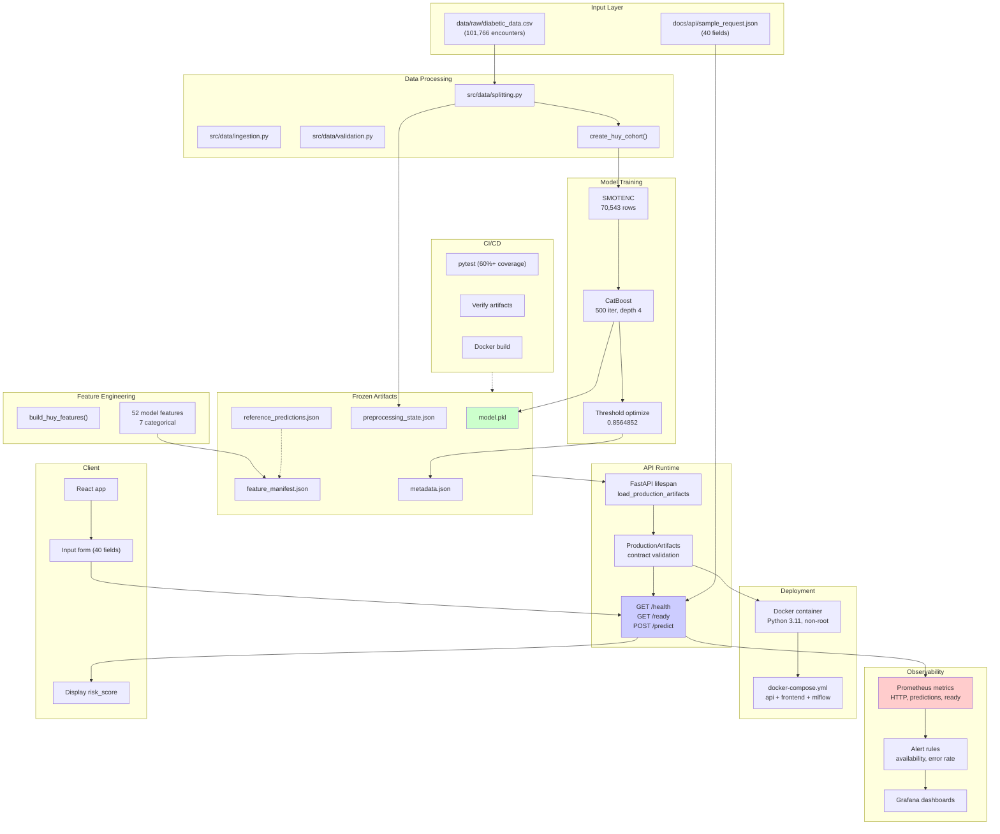
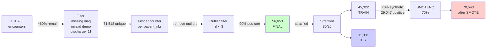
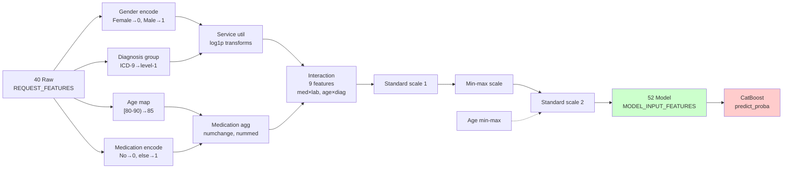
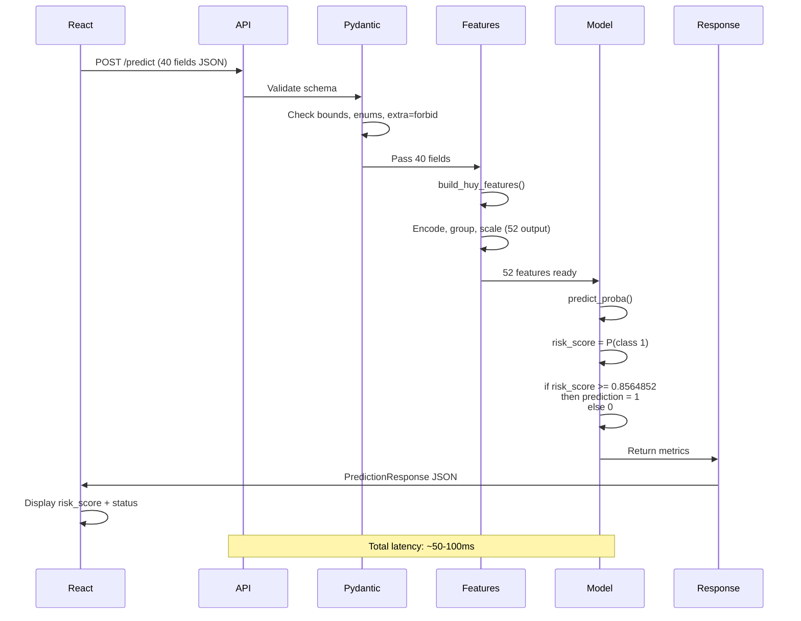
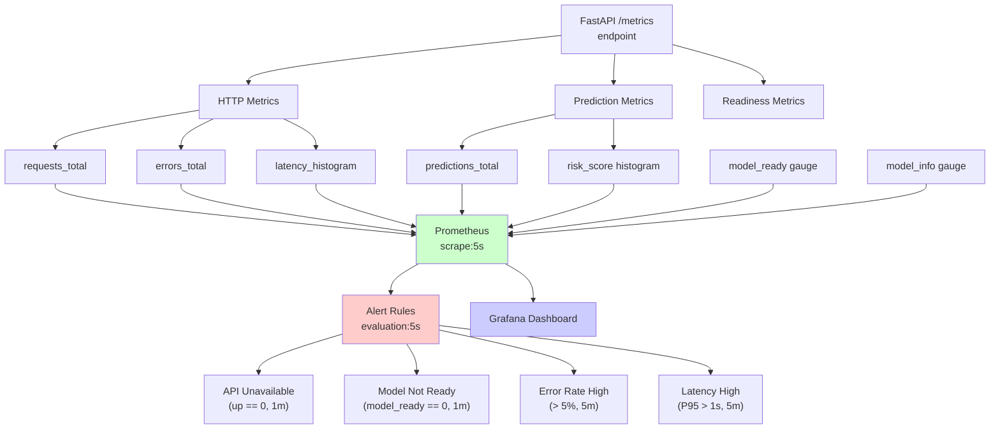
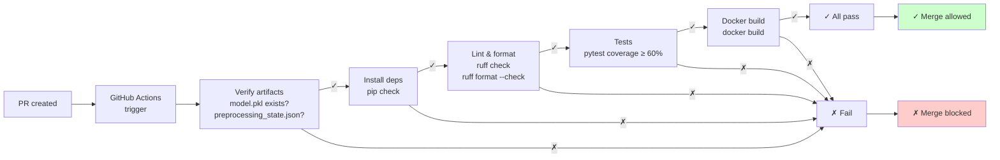
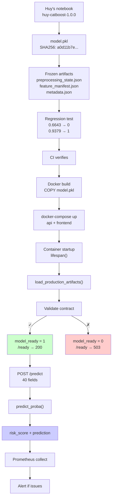

# DIAGRAMS & QUICK REFERENCE

## I. EXECUTABLE DIAGRAMS (Copy-paste ready)

### A. FULL SYSTEM ARCHITECTURE



### B. DATA FLOW: 101K → 56K → TRAIN/TEST → SMOTE



### C. FEATURE ENGINEERING PIPELINE (40 → 52)



### D. API REQUEST → PREDICTION FLOW



### E. MONITORING & ALERT FLOW



### F. CI/CD PIPELINE



### G. MODEL LIFECYCLE



---

## II. COMPARISON TABLE: TRAINING vs EVALUATION vs SERVING

| Phase | Data | Process | Artifacts | Goal |
| --- | --- | --- | --- | --- |
| **Training** | 70,543 (after SMOTE) | CatBoost fit 500 trees, depth 4, class_weights | model.pkl, preprocessing_state.json, metadata.json | Learn pattern from imbalanced data |
| **Evaluation** | 11,331 (test holdout) | predict_proba() + threshold 0.8564852, confusion matrix | evaluation_metrics.json, calibration_curve.csv | Measure performance (recall 5%, ROC 0.567) |
| **Serving** | 1 sample at a time (inference request) | build_huy_features() 40→52, predict_proba(), threshold | model.pkl (loaded), preprocessing_state.json (frozen) | Return risk_score to client |

---

## III. FEATURE CONTRACT MAPPING

**Request → Model transformation:**

| Index | Request Feature | Type | Transform | Model Feature |
| --- | --- | --- | --- | --- |
| 0 | race | categorical | Str pass-through | race |
| 1 | gender | categorical | {Female→0, Male→1} | gender |
| 2 | age | categorical | {[80-90)→85, ...} | age |
| ... | ... | ... | ... | ... |
| 14 | max_glu_serum | categorical | Abnormal binary | max_glu_serum |
| 15 | A1Cresult | categorical | Abnormal binary | A1Cresult |
| 16-35 | medications (20) | categorical | {No→0, Up→1, Down→1, Steady→1} | medications |
| 36 | change | categorical | {No→0, Ch→1} | change |
| 37 | diabetesMed | categorical | {No→0, Yes→1} | diabetesMed |
| 38 | diag_1 | string | ICD-9 group → [0,8] | level1_diag1 |
| 39 | (extra fields removed) | | | |
| **NEW** | numchange | derived | Count of Up/Down | numchange |
| **NEW** | nummed | derived | Count != No | nummed |
| **NEW** | service_utilization_log1p | derived | log1p(out+emerg+inp) | service_utilization_log1p |
| ... | ... | ... | ... | ... |
| **52** | interactions (9) | derived | med×lab, age×diag, ... | Various |

**Categorical indices [0, 3, 4, 5, 11, 12, 37]:**
- 0: race
- 3: admission_type_id
- 4: discharge_disposition_id
- 5: admission_source_id
- 11: max_glu_serum
- 12: A1Cresult
- 37: level1_diag1

---

## IV. THRESHOLD VISUALIZATION

```
Risk Score Distribution (test set)
│
│  ▁▂▃▄▅▆▇█ (histograms represent continuous distribution)
│  ▃▆████▅▂
│  ▅██████▃
│  ▂█████▅▂▁
│  ▁████▂▁
└──────────────────────────────────→ Risk Score (0 to 1)
   0   0.25  0.5   0.75  0.8564852  1.0

   Threshold = 0.8564852

   Before: predict 0 (not high risk)
   ↓ threshold
   ↓
   After: predict 1 (high risk)
```

**Interpretation:**
- Threshold 0.5: Default (50% confidence needed)
- Threshold 0.8564852: High confidence (85.6% needed)
  - Fewer false positives (better precision)
  - More false negatives (worse recall) ← recall 5.13%

---

## V. ERROR MATRIX INTERPRETATION

```
Test set (11,331 total)

         Predicted 0      Predicted 1
         (no readmit)     (readmit)

Actual 0
(no):    10,115 TN        260 FP        = 10,375 actual negative
         (correct)        (false alarm)

Actual 1
(<30):   907 FN           49 TP         = 956 actual positive
         (missed)         (caught)

         11,022           309
         predicted neg    predicted pos

KEY METRICS:
─────────────────────────────────────
Sensitivity (Recall) = TP/(TP+FN) = 49/956 = 5.1% ← LOW
Specificity = TN/(TN+FP) = 10115/10375 = 97.5% ← HIGH

Precision = TP/(TP+FP) = 49/309 = 15.9% ← LOW
False Positive Rate = FP/(FP+TN) = 260/10375 = 2.5% ← LOW

F1 Score = 2 × (Prec × Rec) / (Prec + Rec) = 7.7% ← VERY LOW

Interpretation:
─────────────────────────────────────
✗ Model very BAD at finding readmissions (5% recall)
✓ Model GOOD at ruling out non-readmission (97% specificity)
✗ When model predicts readmission, usually wrong (16% precision)
→ NOT suitable for clinical screening
```

---

## VI. DATA SANITY CHECKS (Quick validation)

**Pass these checks before presentation:**

```
✓ Model file exists
  ls -la models/production_huy/model.pkl

✓ SHA256 matches
  sha256sum models/production_huy/model.pkl
  → a0d11b7ed0c1956d10afbfda360ec24ae2c55f6d6d50d32ed50780a81160331b

✓ Metadata valid
  cat models/production_huy/metadata.json | grep decision_threshold
  → 0.8564852152742759

✓ Reference predictions match
  python -c "
  from src.api.dependencies import load_production_artifacts
  artifacts = load_production_artifacts(Path('models/production_huy'))
  print(artifacts.model_version)
  print(artifacts.decision_threshold)
  print(artifacts.model_sha256)
  "

✓ Tests pass
  pytest tests/production/ -v

✓ API starts
  python -m uvicorn src.api.main:app --port 8000
  curl http://127.0.0.1:8000/ready
  → {"status": "ready", ...}

✓ Prediction works
  curl -X POST http://127.0.0.1:8000/predict \
    -H 'Content-Type: application/json' \
    --data @docs/api/sample_request.json
  → {"model_version": "huy-catboost-1.0.0", "risk_score": 0.6643..., ...}
```

---

## VII. ONE-PAGE EXECUTIVE SUMMARY

### Patient Readmission ML System

**What:** Reproduce Huy's CatBoost model predicting 30-day hospital readmission risk. Serve as production system with monitoring & tests.

**Data:**
- Raw: 101,766 encounters → Final: 56,653 (44% filtered)
- Train: 45,322 (91.6% negative) → SMOTE → 70,543 (59.3% negative, 40.7% synthetic positive)
- Test: 11,331 (91.5% negative) — NO SMOTE

**Model:**
- Algorithm: CatBoost Classifier
- Features: 40 raw → 52 engineered (encoding, diagnosis grouping, interactions, log transforms, scaling)
- Hyperparameters: 500 trees, depth 4, learning_rate 0.0185, class_weights {0:1, 1:10}
- Threshold: 0.8564852 (optimized via 6-fold CV, not default 0.5)

**Performance (Test):**
| Metric | Value | Verdict |
| --- | --- | --- |
| Recall | 5.1% | WEAK |
| Precision | 15.9% | WEAK |
| ROC-AUC | 0.567 | WEAK |
| PR-AUC | 0.108 | WEAK |
| Brier | 0.386 | NOT calibrated |

**Infrastructure:**
- API: FastAPI, Pydantic validation (40-field schema, extra=forbid)
- Docker: Non-root user, healthcheck, frozen model (no retrain)
- Monitoring: Prometheus + Grafana, 4 alert rules (availability, errors, latency)
- CI/CD: GitHub Actions, artifact verification, pytest (60%+ coverage), Docker build
- Tests: Production contract tests, reference predictions exact to ±1e-12

**Limitations (Documented):**
1. Recall 5.13% → misses 90% of readmissions → NOT clinical production
2. Data leakage → preprocessing fit before split
3. SMOTENC before CV → synthetic samples may leak
4. Probability uncalibrated → Brier 0.386
5. Threshold optimized on training folds (potential overfitting)

**Verdict:**
- **MLOps engineering:** Excellent (reproducible, contract-driven, comprehensive testing, transparent)
- **Model performance:** Weak (recall 5%, ROC 0.567)
- **Suitable for:** Course demonstration, learning MLOps patterns
- **NOT suitable for:** Clinical production without major retraining

---

## VIII. "IF I FORGET" RECOVERY CHECKLIST

During presentation, if you forget something:

**Numbers:**
- [ ] Have cheat sheet with 101k/56k/45k/70k/11k
- [ ] Have metadata.json open for exact threshold
- [ ] Have MODEL_CARD.md for exact metrics

**Diagrams:**
- [ ] Have data flow diagram (101k → 56k → split → SMOTE)
- [ ] Have feature engineering steps (40 → 52)
- [ ] Have API flow (40 fields → 52 features → predict → response)

**Answers:**
- [ ] "101k → 56k" = filters + first encounter
- [ ] "70k" = SMOTENC: 41,496 + 29,047 synthetic
- [ ] "Recall 5%" = misses 90% readmissions
- [ ] "Threshold 0.8564852" = optimized CV, not 0.5
- [ ] "Data leakage" = preprocessing fit before split (documented)

**If examiner asks something you don't know:**
- Say: "That's a great question. Let me check the code/docs to be precise."
- (Reference AUDIT_COMPLETE.md, MODEL_CARD.md, metadata.json, code)
- Never guess; accuracy > speed

---

END OF DIAGRAMS & REFERENCE
