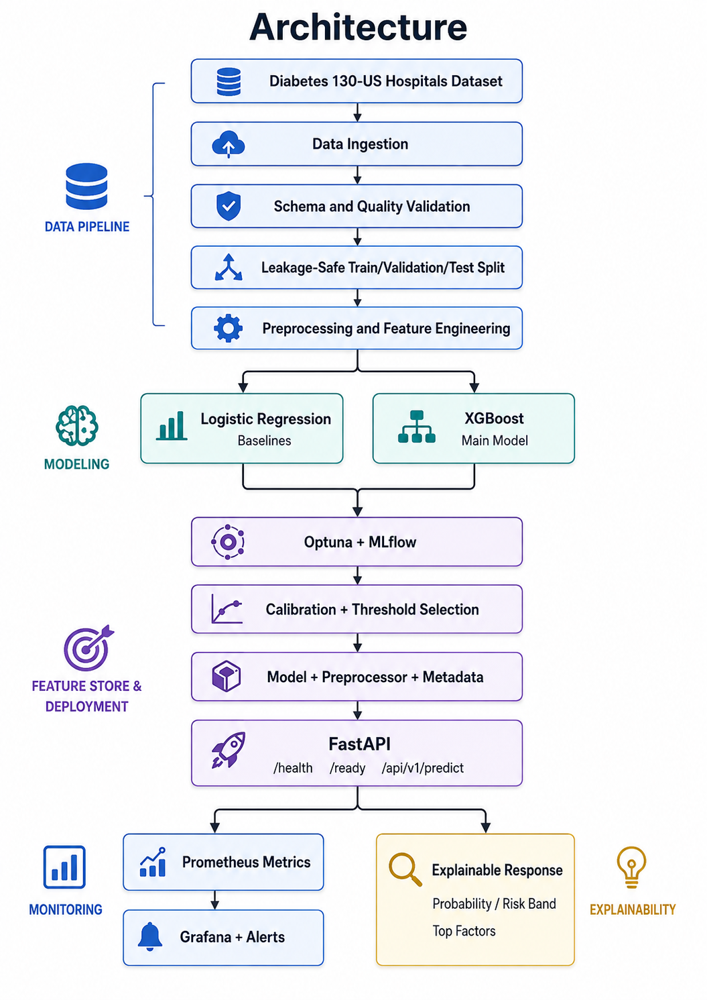

# Patient Readmission ML System

End-to-end machine learning and MLOps system for predicting whether a patient is likely to be readmitted to hospital within 30 days.

## Status

- Status: In development
- Execution window: 3 August 2026 - 18 August 2026
- Team: 4 members
- Dataset: Diabetes 130-US Hospitals

## Overview

This project goes beyond a notebook-only ML experiment. It covers the complete lifecycle:

- Data ingestion, validation, preprocessing, and leakage prevention
- Dummy Classifier and Logistic Regression baselines
- XGBoost training and Optuna tuning
- MLflow experiment and artifact tracking
- Probability calibration and operating-threshold selection
- SHAP explainability and subgroup fairness analysis
- FastAPI model serving
- Docker and Docker Compose orchestration
- Prometheus metrics, Grafana dashboards, and alerts
- Automated testing and GitHub Actions CI
- Responsible AI, Model Card, architecture, and demo documentation

The planning document labels repository initialization as Phase 0, while the execution tracker schedules those tasks inside Phase 1. This README follows the tracker numbering for the delivery timeline.

## Problem Statement

The system estimates the probability that a patient will be readmitted within 30 days. The output is intended to support analysis and prioritization, not to act as a medical diagnosis or a standalone clinical decision.

## Objectives

- Build a reproducible raw-data-to-model pipeline
- Prevent target and temporal leakage
- Compare simple baselines with tuned XGBoost
- Produce calibrated probabilities and a documented decision threshold
- Serve explainable predictions through an API
- Demonstrate practical MLOps through tracking, testing, containers, monitoring, and CI/CD

## Required Scope

The following components must remain in the final project:

- Logistic Regression baseline
- XGBoost candidate model
- MLflow experiment tracking
- FastAPI inference service
- Docker and Docker Compose
- Prometheus monitoring
- At least one Grafana dashboard
- Data, model, and API tests
- GitHub Actions CI
- Responsible AI documentation
- README and architecture documentation

When the schedule is at risk, reduce scope in this order:

1. Cloud deployment
2. Random Forest
3. Per-request local SHAP
4. Advanced drift detection
5. Isotonic calibration
6. Number of Optuna trials
7. Extra Grafana dashboards
8. Advanced feature engineering

## Dataset and Target

### Dataset

The project uses the Diabetes 130-US Hospitals dataset.

Raw data belongs under `data/raw/` and must not be committed to Git. Record the dataset source, checksum, and metadata so the input can be verified without storing patient-level data in the repository.

### Target

The target is readmission within 30 days.

Before training, the project must document:

- Target-value mapping
- Leakage exclusions
- Missing values and duplicates
- Class distribution
- Train, validation, and test split manifest
- Feature manifests for V1 and V2

## Architecture



Detailed diagrams belong in `ARCHITECTURE.md`.

## Technology Stack

| Area | Technology |
| --- | --- |
| Language | Python |
| Data and ML | pandas, scikit-learn, XGBoost |
| Tuning | Optuna |
| Tracking | MLflow |
| Explainability | SHAP |
| API | FastAPI, Pydantic |
| Testing | pytest |
| Containers | Docker, Docker Compose |
| Monitoring | Prometheus, Grafana |
| CI/CD | GitHub Actions |
| Version control | Git and GitHub |

Pin the final dependency versions in `requirements.txt`.

## Repository Structure

```text
patient-readmission-ml-system/
├── data/
│   ├── raw/
│   ├── interim/
│   └── processed/
├── notebooks/
│   ├── 01_data_understanding.ipynb
│   ├── 02_eda.ipynb
│   ├── 03_baseline.ipynb
│   └── 04_explainability.ipynb
├── src/
│   ├── config/
│   │   └── settings.py
│   ├── data/
│   │   ├── ingestion.py
│   │   ├── validation.py
│   │   └── preprocessing.py
│   ├── features/
│   │   └── build_features.py
│   ├── models/
│   │   ├── train.py
│   │   ├── evaluate.py
│   │   ├── tune.py
│   │   ├── calibrate.py
│   │   └── threshold.py
│   ├── api/
│   │   ├── main.py
│   │   ├── schemas.py
│   │   ├── dependencies.py
│   │   └── routes.py
│   └── monitoring/
│       └── metrics.py
├── tests/
│   ├── unit/
│   ├── integration/
│   ├── data/
│   └── model/
├── monitoring/
│   ├── prometheus.yml
│   ├── alert_rules.yml
│   └── grafana/
├── mlruns/
├── models/
├── scripts/
├── .github/workflows/
├── Dockerfile
├── docker-compose.yml
├── requirements.txt
├── README.md
├── ARCHITECTURE.md
├── CONTRIBUTING.md
├── RESPONSIBLE_AI.md
└── MODEL_CARD.md
```

## Getting Started

### Prerequisites

- Python 3.11.0
- Git
- Docker and Docker Compose version 27.4.1

### Clone and install
cd patient-readmission-ml-system

rm -rf .venv
python3.11 -m venv .venv
source .venv/bin/activate

python --version
which python

python -m pip install --upgrade pip setuptools wheel
python -m pip install -r requirements.txt

python -m pip check

python -c "from src.api.main import app; print(app.title)"

python -m ruff check .
python -m ruff format --check .

python -m pytest -q
python -m pytest --cov=src --cov-report=term-missing

python -m uvicorn src.api.main:app \
  --host 0.0.0.0 \
  --port 8000 \
  --reload

Windows activation:

```bash
.venv\Scripts\activate
```

When `.env.example` is available:

```bash
cp .env.example .env
```

Never commit `.env`, credentials, raw patient data, or large model binaries.

## Data Pipeline

Place the downloaded dataset under:

```text
data/raw/
```

### Planned commands

```bash
python -m src.data.ingestion
python -m src.data.validation
python -m src.data.preprocessing
```

### Expected outputs

- Raw-data checksum and metadata
- EDA report
- Target mapping and leakage checklist
- Validation report and failure handling
- Reproducible split manifest
- Serializable preprocessing pipeline
- Feature manifests V1 and V2

Keep these commands synchronized with the final implementation.

## Model Development

### Baselines

The baseline sequence is:

- Dummy Classifier
- Logistic Regression
- Class-balanced Logistic Regression

The Dummy Classifier establishes the minimum reference performance that trained models must exceed.

### Main model

XGBoost is the main candidate model.

Planned sequence:

1. Train default XGBoost
2. Compare class-imbalance settings, including `scale_pos_weight`
3. Tune with Optuna using approximately 20-40 trials
4. Compare feature sets V1 and V2
5. Select and export the candidate model
6. Package the model, preprocessor, and metadata together

### Planned commands

```bash
python -m src.models.train
python -m src.models.tune
python -m src.models.evaluate
python -m src.models.calibrate
python -m src.models.threshold
```

### Calibration and threshold

The project compares the uncalibrated candidate with sigmoid calibration. Calibration evaluation includes the Brier score and a calibration curve.

The operating threshold must be selected from validation data, not from the final holdout test set. The threshold report must explain the recall and precision trade-off.

## MLflow Tracking

Each meaningful run should record:

- Model type
- Feature-set version
- Data or split version
- Hyperparameters
- Evaluation metrics
- Calibration configuration
- Selected threshold
- Model, preprocessor, and metadata artifacts

Start the configured services with:

```bash
docker compose up --build
```

The MLflow address and exposed port are defined by `docker-compose.yml`.

## API

### Planned endpoints

| Endpoint | Purpose |
| --- | --- |
| `GET /health` | Process health check |
| `GET /ready` | Model and dependency readiness |
| `POST /api/v1/predict` | Readmission-risk prediction |

The prediction response is planned to include:

- Readmission probability
- Risk band
- Top contributing factors

The final input contract is defined in `src/api/schemas.py`.

### Run locally

```bash
uvicorn src.api.main:app --host 0.0.0.0 --port 8000 --reload

python -m uvicorn src.api.main:app \
  --host 0.0.0.0 \
  --port 8000 \
  --reload
  
```

### Swagger/OpenAPI

- Swagger UI: http://localhost:8000/docs
- ReDoc: http://localhost:8000/redoc
- OpenAPI JSON: http://localhost:8000/openapi.json

### Example request

```bash
curl -X POST "http://localhost:8000/api/v1/predict" \
  -H "Content-Type: application/json" \
  --data @sample_request.json
```

The API schema, preprocessing pipeline, feature order, and model metadata must remain synchronized.

## Docker Compose

```bash
# Build and start
docker compose up --build

# Check services
docker compose ps

# Follow logs
docker compose logs -f

# Stop
docker compose down
```

Use `docker compose down -v` only when a full local-volume reset is necessary.

The final stack must start with one command and include service health checks and persistent volumes where required.

## Monitoring and Alerts

Prometheus collects API metrics. The first Grafana dashboard must show at least:

- Request volume
- Request latency
- Error rate
- Prediction-risk distribution

Alert rules should cover:

- High latency
- Elevated error rate
- Model or readiness unavailability

Advanced drift detection is optional.

## Testing

### Test areas

- Unit tests
- Data-quality and leakage tests
- Model-validation tests
- API integration tests

### Run all tests

```bash
pytest
```

### Run selected groups

```bash
pytest tests/data
pytest tests/model
pytest tests/integration
```

Final validation must include:

- Clean end-to-end pipeline run
- Full passing test suite
- Final holdout evaluation
- Model-artifact checksum
- Clean Docker Compose smoke test
- Valid and invalid API cases
- Health and readiness verification

## CI/CD

GitHub Actions should run on pull requests and protected branches.

### Required CI checks

- Linting
- Automated tests
- Test coverage
- Docker image build

A pull request is complete only after the required checks pass and at least one teammate reviews it.

## Responsible AI

### Required Responsible AI outputs

- Subgroup slices
- Group-level performance table
- Global SHAP summary
- Top-feature analysis
- Limitations and intended-use statement

- `RESPONSIBLE_AI.md`
- `MODEL_CARD.md`

The prediction is a risk estimate, not a diagnosis. Performance differences across groups must be reported and discussed rather than hidden.

## Team Roles

Replace the placeholders with real names in the tracker and repository.

| Role | Responsibility |
| --- | --- |
| Owner | Role / Responsibilities |
| Reviewer | Q&A ownership |
| Member A | Data Lead: dataset, EDA, validation, preprocessing, feature engineering, data tests, fairness slices |
| Member B | Dataset, leakage, preprocessing |
| Member B | ML Lead: baselines, XGBoost, Optuna, MLflow, calibration, threshold, SHAP, model tests |
| Member C | Metrics, tuning, threshold, explainability |
| Member C | Backend Lead | FastAPI, OpenAPI schemas, model loading, API tests, Dockerfile, API dependency requirements, Docker image build support |
| Member D | API, Docker, serving, error handling |
| Member D | MLOps and Documentation Lead: Docker Compose, GitHub Actions,Prometheus, Grafana, alerts, CI/CD, deployment, Responsible AI, documentation, slides |
| Member A | Architecture, monitoring, Responsible AI, CI/CD |

## Git Workflow

```text
feature branch
      |
      v
 Pull Request
      |
      v
 Code Review
      |
      v
   develop
      |
      v
    main
```

### Planned branches

- `main`
- `develop`
- `feature/data-pipeline`
- `feature/model-training`
- `feature/api`
- `feature/monitoring`
- `feature/responsible-ai`

### Working rules

- Hold a 15-minute daily stand-up: completed, today, blocker
- Merge stable work into `develop` at the end-of-day integration checkpoint
- Every technical task needs a deliverable and PR or commit evidence
- At least one teammate reviews every pull request
- Freeze feature development after Day 12; only critical defect fixes follow
- Every member completes at least one pull request

## Delivery Timeline

| Days | Phase | Main outcome |
| --- | --- | --- |
| 1-2 | Phase 1 - Foundations | Repository, board, dataset understanding, target, metrics, API skeleton |
| 3-5 | Phase 2 - Pipeline and baselines | Ingestion, validation, split, preprocessing, baselines, API contract, Docker/MLflow skeleton |
| 6-8 | Phase 3 - Candidate model | Feature sets, XGBoost, Optuna, candidate export, real API, Prometheus, Grafana |
| 9-10 | Phase 4 - Calibration and Responsible AI | Calibration, threshold, fairness, SHAP, explainable response, Model Card |
| 11-12 | Phase 5 - Testing and orchestration | Data/model/API tests, Compose health checks, CI, alerts, feature freeze |
| 13-14 | Phase 6 - Documentation and demo | README, architecture, technical sections, slides, demo evidence |
| 15-16 | Phase 7 - Validation and submission | Clean runs, holdout validation, smoke tests, audits, rehearsal, final freeze |

## Definition of Done

The project is complete when:

- Repository structure and branch strategy are documented
- Every task has an owner, deadline, and deliverable
- Each member has at least one pull request
- Linting and automated tests pass
- Raw patient data, secrets, and large binaries are excluded from Git
- Data ingestion, validation, preprocessing, and splitting are reproducible
- Baseline and candidate experiments are recorded in MLflow
- Calibration and threshold selection are documented
- The model, preprocessor, and metadata package are exported together
- The API passes valid, invalid, health, and readiness tests
- Docker Compose starts all required services successfully
- Prometheus metrics, Grafana dashboard, and alerts work
- GitHub Actions runs linting, tests, coverage, and Docker build
- Responsible AI and Model Card documents are complete
- A clean end-to-end run and final smoke test are recorded
- README, architecture, slides, and demo evidence are complete

## Troubleshooting

### `/ready` fails

- Confirm the model and preprocessing artifacts exist
- Check configured artifact paths
- Verify model metadata matches the exported artifacts
- Review API logs

### Request validation fails

- Compare the request with the current Swagger example
- Confirm required fields and data types
- Verify the API schema and preprocessing feature names match

### MLflow shows no runs

- Verify the tracking URI and experiment name
- Check the MLflow service health and logs
- Confirm persistent-volume permissions

### Prometheus cannot scrape the API

- Confirm the metrics endpoint is enabled
- Check the target name and container network in `prometheus.yml`
- Confirm the API is healthy and reachable from Prometheus

### Grafana shows no data

- Verify the Prometheus data source
- Confirm Prometheus is scraping the API
- Check dashboard queries and time range

### Docker Compose fails

```bash
docker compose config
docker compose ps
docker compose logs -f
```

Inspect configuration and logs before deleting volumes.

## Documentation

- `README.md`: setup, training, API, Docker, monitoring, testing, troubleshooting
- `ARCHITECTURE.md`: system architecture and data flow
- `CONTRIBUTING.md`: branch, review, coding, and contribution rules
- `RESPONSIBLE_AI.md`: fairness, risks, limitations, and ethical considerations
- `MODEL_CARD.md`: intended use, data, model, evaluation, and caveats

## Items to Finalize

Update these values after implementation and evaluation:

- Real team-member names
- Repository URL
- Exact Python and dependency versions
- Final API request schema
- Docker Compose ports and service URLs
- Evaluation metrics and acceptance thresholds defined by ML-01
- Best Optuna parameters
- Selected feature set and candidate model
- Calibration results and operating threshold
- Final holdout metrics
- Fairness and SHAP findings
- CI badge and test coverage

Verify every command during the Phase 7 clean run.